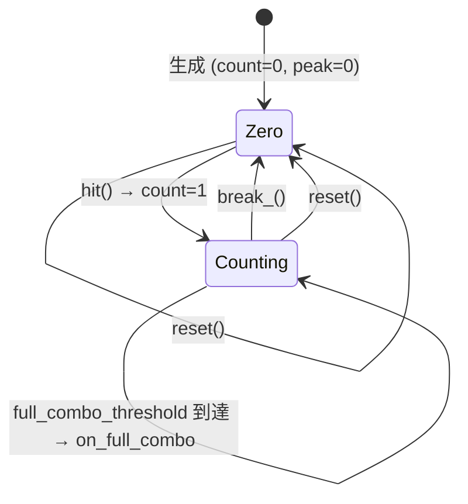

# ergo_combo_counter — 連続成功カウンタ

> **Repo**: [`include/ergo/combo_counter/combo_counter.h`](https://github.com/LUDIARS/Ergo/blob/main/include/ergo/combo_counter/combo_counter.h)
> **lexicon Feature**: [`combo-counter`](../game-lexicon/features/rhythm/combo-counter.toml) + 関連 [`combo-system`](../game-lexicon/features/action/combo-system.toml)

## 1. 一文要約

連続成功 (hit) を数え、 失敗 (break) でリセットする小さなカウンタ。 ピーク (最大コンボ) と任意の **フルコンボ閾値** に到達したときの通知を持つ。

## 2. 公開 API

```cpp
namespace ergo::combo_counter {

struct Config {
    std::int32_t full_combo_threshold = 0;   // 0 で無効
};

class ComboCounter {
public:
    using ChangeHandler = std::function<void(std::int32_t count)>;
    using BreakHandler  = std::function<void(std::int32_t broken_count)>;
    using FullHandler   = std::function<void(std::int32_t count)>;

    ComboCounter() = default;
    explicit ComboCounter(Config cfg);

    void hit();         // 成功 → count++ + peak 更新
    void break_();      // 失敗 → 0 にリセット (count > 0 の時のみ on_break)
    void reset();       // 強制ゼロ (peak も)、 on_break は出さない

    [[nodiscard]] std::int32_t count() const noexcept;
    [[nodiscard]] std::int32_t peak() const noexcept;

    void set_on_change(ChangeHandler);
    void set_on_break(BreakHandler);
    void set_on_full_combo(FullHandler);
};

}
```

## 3. 振る舞い契約

| 操作 | 副作用 | コールバック |
|------|--------|-------------|
| `hit()` | `count++`、 `peak = max(peak, count)` | `on_change(count)` 必、 `count == full_combo_threshold` (1 度のみ) で `on_full_combo` |
| `break_()` (count > 0) | `count = 0` | `on_break(prev)` + `on_change(0)` |
| `break_()` (count == 0) | 何もしない | — (no-op) |
| `reset()` (count != 0) | `count = 0`、 `peak = 0` | `on_change(0)` (on_break 出さない) |
| `reset()` (count == 0) | `peak = 0` | (callback なし) |

### 不変条件

- `peak >= count`
- `peak >= 0`
- `count >= 0`
- `on_full_combo` は **count が threshold ぴったり** で 1 回のみ (超過しても再発火しない)
- `break_()` は count が 0 のとき完全 no-op (callback も出さない) → 「ミス連打」 OK

## 4. 状態遷移



## 5. 使い方

### 音ゲーでの典型的な使い方

```cpp
#include "ergo/combo_counter/combo_counter.h"
#include "ergo/timing_judge/timing_judge.h"

ergo::combo_counter::Config cfg;
cfg.full_combo_threshold = chart.note_count();   // 全ノート PERFECT/GREAT で発火
ergo::combo_counter::ComboCounter combo(cfg);

combo.set_on_change([&hud](int n) { hud.set_combo(n); });
combo.set_on_break([&hud](int prev) { hud.flash_break(prev); });
combo.set_on_full_combo([&hud, &session](int n) {
    hud.show_full_combo();
    session.unlock_full_combo_reward();
});

// ノート判定処理
auto j = ergo::timing_judge::judge(target, actual, windows);
if (ergo::timing_judge::breaks_combo(j, ergo::timing_judge::Judgment::Great)) {
    combo.break_();
} else {
    combo.hit();
}
```

### アクションでの典型的な使い方

```cpp
ergo::combo_counter::ComboCounter combo;

// プレイヤー攻撃ヒット時
combo.hit();
score.add(damage_value, combo.count());

// 被弾 / 攻撃外し / フェードアウト時
combo.break_();
```

> アクションでは `full_combo_threshold` は通常 0 (= 機能 OFF)。 音ゲーは譜面ノート数を入れる。

## 6. score との統合

`add(base, combo_count)` の引数に `combo.count()` を渡すと倍率反映:

```cpp
void on_hit_event(int base_points) {
    auto applied = score.add(base_points, combo.count());
    combo.hit();
    spawn_score_text(applied);
}

void on_miss_event() {
    combo.break_();
    // score は減らさない (一般的な設計)
}
```

> **順序の注意**: `score.add` を **combo.hit() の前** に呼ぶと、 ヒット直前のコンボ数で倍率計算される (= ヒット 1 回目はノーマル、 2 回目から 1.05x、 ... という流派)。 `combo.hit()` を先にすると 1 回目から +1 倍率がかかる流派。 ゲーム性で選ぶ。

## 7. パラメータ (lexicon と同期)

[`combo-counter.toml`](../game-lexicon/features/rhythm/combo-counter.toml):

| TOML key | C++ field / 動作 |
|----------|------------------|
| `full_combo_event` | `Config::full_combo_threshold > 0` で有効 |
| `break_judge` | `breaks_combo(j, min_kept)` で実装 (`ergo_timing_judge` 側) |

## 8. テスト

`tests/combo_counter/test_combo_counter.cpp` で 6 件:

- `StartsAtZero`
- `HitIncrementsAndUpdatesPeak`
- `BreakFiresOnlyIfThereWasACombo`
- `FullComboFiresAtThresholdOnly`
- `ChangeFiresOnHitAndBreak`
- `ResetClearsPeak`

## 9. 拡張点 (将来)

- **コンボ猶予 (decay)**: 一定時間 hit がないと自動 break — アクション系でよくある (現状は明示 `break_()` のみ)
- **段階的フルコンボ通知** (50 / 100 / 200 / 全ノート で発火) — 現状は閾値 1 つ
- **コンボブースト** との連携 (アイテムで一時的に倍率増)

## 10. 既知の制限

- decay (時間切れリセット) は未実装
- threshold 複数指定不可
- 統計用の **ミス回数累計** は別途 (例: `Score` の counter / アプリ側のカウンタ) で持つ必要
