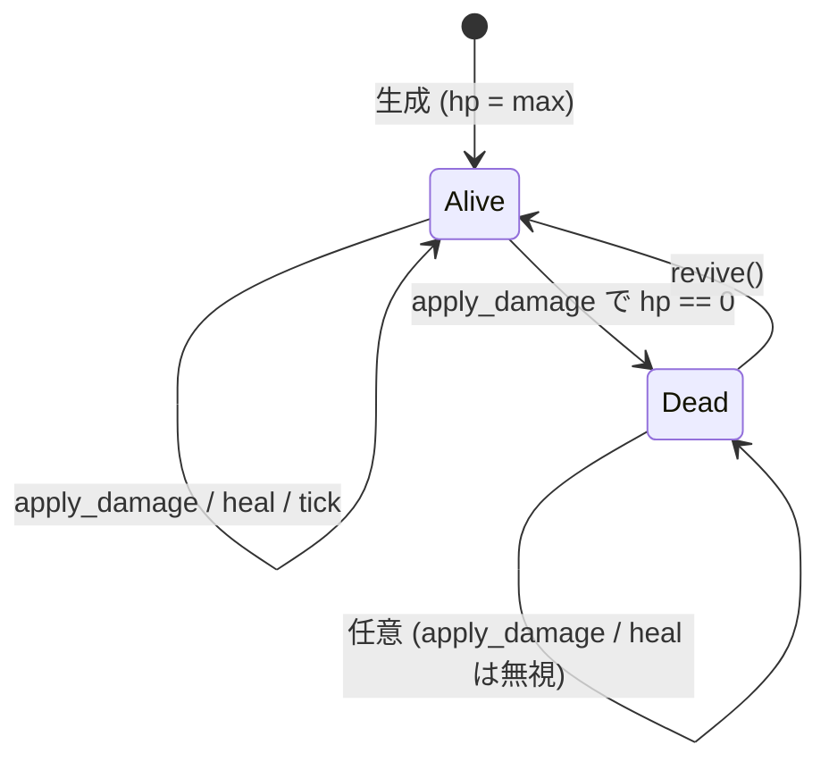

# ergo_health — HP コンテナ

> [!info]
> **Repo**: [LUDIARS/Ergo `include/ergo/health/health.h`](https://github.com/LUDIARS/Ergo/blob/main/include/ergo/health/health.h)
> **Spec**: [LUDIARS/Ergo `spec/module/health.md`](https://github.com/LUDIARS/Ergo/blob/main/spec/module/health.md)
> **lexicon Feature**: [`health-system`](../game-lexicon/features/core/health-system.toml)

## 1. 一文要約

任意のアクター / エンティティに組み込める HP コンテナ。 ダメージ・回復・死亡コールバックと、 任意の自動回復 (regen) を持つ純粋データ + コールバックのモジュール。

## 2. 公開 API

```cpp
namespace ergo::health {

struct Config {
    std::int32_t max_hp           = 100;
    float        regen_per_second = 0.0f;   // 0 で無効
    bool         fire_death_event = true;
};

class Health {
public:
    using DeathHandler  = std::function<void()>;
    using DamageHandler = std::function<void(std::int32_t amount, std::int32_t hp_after)>;
    using HealHandler   = std::function<void(std::int32_t amount, std::int32_t hp_after)>;

    Health() = default;
    explicit Health(Config cfg);

    // 入力 (ホスト → Health)
    void apply_damage(std::int32_t amount);
    void heal(std::int32_t amount);
    void tick(float dt_seconds);
    void revive();

    // 出力 (Health → ホスト)
    [[nodiscard]] std::int32_t hp() const noexcept;
    [[nodiscard]] std::int32_t max_hp() const noexcept;
    [[nodiscard]] bool is_dead() const noexcept;
    [[nodiscard]] float ratio() const noexcept;

    // コールバック登録
    void set_on_damage(DamageHandler);
    void set_on_heal(HealHandler);
    void set_on_death(DeathHandler);
};

}  // namespace ergo::health
```

## 3. 振る舞い契約 (Contract)

| 操作 | 副作用 | コールバック |
|------|--------|-------------|
| `apply_damage(n)` (n > 0) | `hp = max(0, hp - n)` | `on_damage(n, hp_after)` 必発火、 hp が 0 になった瞬間のみ `on_death()` |
| `apply_damage(n)` (n <= 0) | 何もしない | — |
| `apply_damage(n)` (死亡中) | 何もしない | — |
| `heal(n)` (n > 0、 生存中) | `hp = min(max_hp, hp + n)` | `on_heal(n, hp_after)` 発火 |
| `heal(n)` (死亡中) | 何もしない | — (revive を要求) |
| `tick(dt)` (生存 + regen > 0) | 端数を内部蓄積、 1 ぶん溜まったら `heal(1)` 経由で発火 | `on_heal` (整数になったタイミングのみ) |
| `tick(dt)` (死亡 / regen 0) | 何もしない | — |
| `revive()` | `hp = max_hp`、 death_fired = false、 regen_accum = 0 | (発火なし) |

### 不変条件

- `0 <= hp <= max_hp`
- `is_dead() ⇔ hp == 0`
- `on_death` は **生存→死亡** の遷移で 1 回のみ発火 (連続ダメージで複数回呼ばない)
- `revive()` 後は再び 1 回発火可能になる

## 4. 内部状態と更新フロー



```cpp
class Health {
private:
    Config        cfg_{};
    std::int32_t  hp_           = 100;
    float         regen_accum_  = 0.0f;
    bool          death_fired_  = false;
    DamageHandler on_damage_{};
    HealHandler   on_heal_{};
    DeathHandler  on_death_{};
};
```

## 5. 使い方 (Ars プロジェクトから)

### 基本パターン

```cpp
#include "ergo/health/health.h"

ergo::health::Config cfg;
cfg.max_hp = 200;
cfg.regen_per_second = 4.0f;
cfg.fire_death_event = true;

ergo::health::Health hp(cfg);

hp.set_on_damage([](int amount, int hp_after) {
    spawn_damage_text(amount);
    flash_red();
});
hp.set_on_death([] {
    spawn_death_vfx();
    transition_to_game_over();
});

// ゲームループ
hp.tick(dt);
if (incoming_attack) {
    hp.apply_damage(20);
}
```

### Ars アクター内部での所有

```rust
// crates/game-action/src/player/actor.rs
pub struct PlayerActor {
    health: ergo_health::Health,    // FFI ラッパ越し
    ...
}

impl Actor for PlayerActor {
    fn tick(&mut self, dt: f32, ctx: &mut TickCtx) {
        self.health.tick(dt);
        ...
    }
}
```

> **NOTE**: 現状 Ergo は C++ 実装。 Ars (Rust) から呼ぶには FFI ラッパが必要。 Phase 2 で `cxx` クレートまたは C ABI 経由で薄いラッパを用意する想定。

## 6. パラメータ (game-lexicon と同期)

[`health-system.toml`](../game-lexicon/features/core/health-system.toml) の parameter 定義と本実装は対応する:

| TOML key | C++ field | デフォルト | 範囲 |
|----------|-----------|-----------|------|
| `max_hp` | `Config::max_hp` | 100 | 1..99999 |
| `regen_per_second` | `Config::regen_per_second` | 0.0 | 0.0..100.0 |
| `death_event` | `Config::fire_death_event` | true | bool |

## 7. テスト (Ergo 同梱)

`tests/health/test_health.cpp` で 9 件:

- `StartsAtMaxAndAlive`
- `DamageReducesHpAndFloorsAtZero`
- `HealCapsAtMax`
- `HealOnDeadDoesNothing`
- `OnDamageAndOnDeathFireOnceEach`
- `RegenAccumulatesFractional`
- `RegenRespectsMax`
- `ReviveResetsHp`
- `RatioReportsCorrectly`

## 8. 拡張点 (将来)

- `ApplyDamageReason` の付与 (kill log / 死因解析用)
- 状態異常 (Poison / Bleed 等) を別モジュール `ergo_status` に切出して合成
- max_hp 動的変更 (装備 / レベルアップ反映) — 現状は Config 渡し直しが必要

## 9. 統合パターン

詳細は [integration.md](integration.md) §"戦闘ループへの組込"。

## 10. 既知の制限

- 整数 (`std::int32_t`) のみ。 浮動小数 HP は将来必要なら別モジュール
- スレッド安全ではない (1 スレッド前提)
- regen は線形のみ (時間関数で曲線変化させたい場合は外側でラップ)
