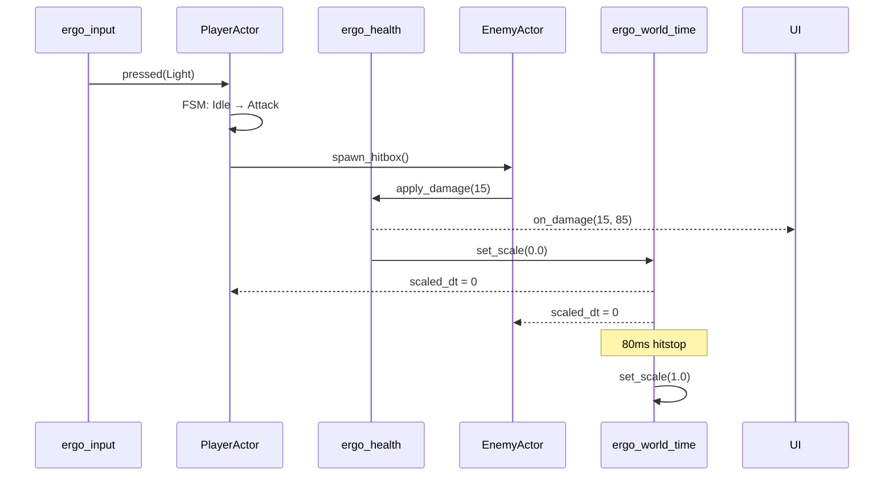
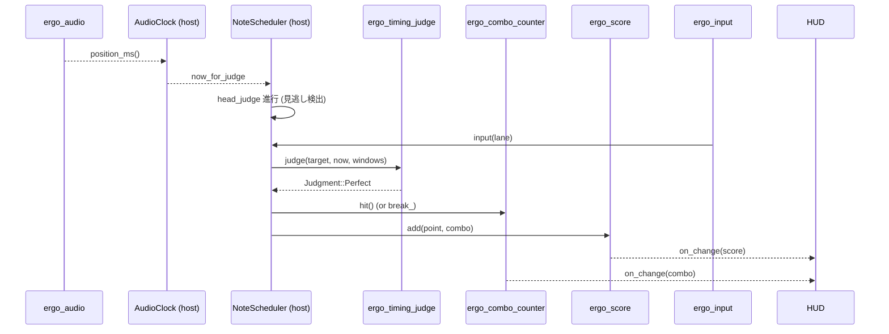
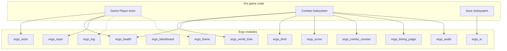

# Ergo 統合パターン

複数の Ergo モジュールを **どう組み合わせて 1 ゲームを構築するか** のパターン集。 アクターレイヤ、 イベント / 同期境界、 セーブ、 デバッグ観点をカバーする。

## 1. アクターレイヤの組み立て

```
┌──────────────────────────────────────────────────┐
│ Layer 4: Host (game-<genre>-app)                 │
│   シーン構築 / 章スクリプト / 演出 override        │
├──────────────────────────────────────────────────┤
│ Layer 3: Game-specific actors                    │
│   PlayerActor / EnemyActor / Boss / NPC          │
├──────────────────────────────────────────────────┤
│ Layer 2: Subsystems                              │
│   HitResolver / CameraRig / LevelLoader / Save   │
├──────────────────────────────────────────────────┤
│ Layer 1: Ergo modules                            │
│   ergo_health / ergo_input / ergo_world_time / ...│
└──────────────────────────────────────────────────┘
```

ジャンル横断のテンプレ: [game-template/<genre>/codedesign/layer.md](../game-template/) 参照。

### アクターの典型的構成

```cpp
class PlayerActor : public ergo::actor::Actor {
    ergo::health::Health      health_;       // HP
    ergo::input::Buffer       input_;        // (Phase 1 ラッパ)
    PostureGauge              posture_;      // ゲーム固有
    StaminaPool               stamina_;      // ゲーム固有
    PlayerFSM                 fsm_;          // ゲーム固有
    Transform                 transform_;

    void tick(float dt, ergo::actor::TickCtx& ctx) override {
        auto scaled_dt = ergo::world_time::scaled(dt);    // hitstop 反映
        input_.tick(scaled_dt);
        if (auto cmd = input_.next_command()) {
            fsm_.dispatch(*cmd);
        }
        fsm_.tick(scaled_dt, ctx);
        posture_.regen(scaled_dt);
        stamina_.regen(scaled_dt);
        health_.tick(scaled_dt);
    }
};
```

## 2. 戦闘ループへの組込 (action 系)



**ポイント**:
- ヒット時は `ergo_world_time::set_scale(0)` で全アクターを停止
- アクター側は `tick(scaled_dt)` を使うので追加コードなしで停止する
- UI / BGM は `dt_raw` を使い分けて停止しない

## 3. 音ゲープレイループ



**ポイント**:
- audio device が **唯一のクロック**。 描画フレームに依存しない
- `now_for_judge = audio_pos + user_offset_ms` で環境差を吸収
- 入力ホットパスは別 thread (低遅延)、 NoteScheduler への push のみ

## 4. セーブ / ロード

`ergo_io` をベースに、 ゲーム個別のシリアライザを薄く被せる:

```cpp
struct PlayerSnapshot {
    int hp;
    int level;
    std::vector<int> inventory;
    // ...

    void serialize(std::vector<uint8_t>& out) const;
    static PlayerSnapshot deserialize(const uint8_t* data, size_t len);
};

void save_to_slot(int slot, const PlayerSnapshot& snap) {
    auto path = save_dir() / fmt::format("save_{}.dat", slot);
    std::vector<uint8_t> bytes;
    snap.serialize(bytes);
    ergo::io::write_all(path, bytes);
}

PlayerSnapshot load_from_slot(int slot) {
    auto path = save_dir() / fmt::format("save_{}.dat", slot);
    auto bytes = ergo::io::read_all(path);
    return PlayerSnapshot::deserialize(bytes.data(), bytes.size());
}
```

**Phase 1 で `ergo_save_slot`** を作って slot 概念を統一する予定。 [roadmap.md §4](roadmap.md#4-ergo_save_slot)。

## 5. ステータスの Blackboard 管理

`stat-system` Feature (jrpg / moba / hns / slg) は `ergo_blackboard` で実装するのが現実解:

```cpp
class Character {
    ergo::blackboard::Property<int> hp_{100};
    ergo::blackboard::Property<int> max_hp_{100};
    ergo::blackboard::Property<int> atk_{10};
    ergo::blackboard::Property<int> def_{5};
    // ...

    void register_into(ergo::blackboard::Engine& bb, std::string_view prefix) {
        bb.register_property(fmt::format("{}.hp", prefix),  hp_);
        bb.register_property(fmt::format("{}.atk", prefix), atk_);
        // ...
    }
};

// UI 側
auto sub = bb.subscribe<int>("party.0.hp", [&hud](int new_hp) {
    hud.update_hp(0, new_hp);
});
```

UI / バフ / セーブ がすべて Blackboard 経由で同期。

## 6. デバッグ / ライブチューニング

開発中は `ergo_bind` でホスト変数を WS 公開 + `tools/ergo` の variable プラグインから編集:

```cpp
float jump_velocity = 12.0f;
BIND_VAR("player.jump_velocity", jump_velocity);    // tools/ergo から編集可

void Player::jump() {
    velocity_.y = jump_velocity;     // 編集が即反映
}
```

リリースビルドでは `BIND_VAR` を no-op マクロにして除外。

## 7. ロギング規約

```cpp
// 致命的: ゲーム続行不能
ergo::log::error("save file corrupted: {}", path);
// 警告: 続行可能だが想定外
ergo::log::warn("hp regen disabled in dead state");
// 情報: 状態遷移
ergo::log::info("player entered region: {}", region.id);
// デバッグ: 開発時のみ
ergo::log::debug("input buffer: {}", buffer);
```

行頭にはフレーム番号が自動で付くので、 「いつ起きたか」 を時系列で追える。

## 8. テスト戦略

| テストの種類 | 担当 | 例 |
|--------------|------|-----|
| ユニット (Ergo 内) | Ergo 自身 | `ergo_health::test_health.cpp` |
| ユニット (ゲーム個別) | 各ゲームクレート | `game-action::test_combat.rs` |
| 統合 (シナリオ) | アプリ | 入力ログリプレイで章クリア |
| 遠隔 / E2E | `ergo_custos` + Custos | スクショ + キー入力 |
| バランス | 自動化 | TTK / XP / クリア時間 を範囲チェック |

## 9. 横断的パフォーマンス指標

| 軸 | 目標 |
|----|------|
| input latency | < 16 ms (60 fps frame 1 つ以内) |
| frame time | < 16.6 ms (60 fps 維持)、 リズム / 格闘は < 8.3 ms (120 fps) 推奨 |
| audio output latency | < 10 ms (rhythm) |
| save read | < 100 ms (起動時) |
| streaming load (open world) | < 2 s / tile |

各モジュールはこの全体予算の 「自分の取り分」 を意識して設計する。

## 10. 依存マップ



## 11. 将来の標準パターン候補

- **イベントバス** (`ergo_event_bus`) — 現在は各ゲームが独自実装
- **乱数決定論** (`ergo_rng`) — リプレイ / セーブ可能な seeded RNG 統一
- **設定 IO** (`ergo_config`) — TOML / YAML loader の共通化

これらは Phase 2-3 で検討。
