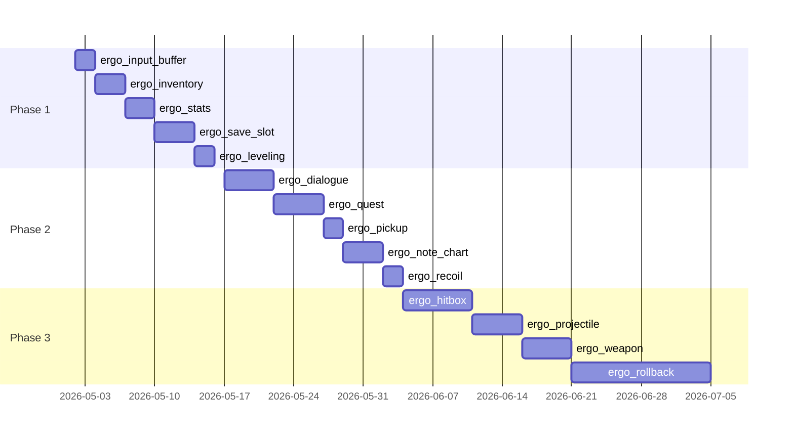

# Ergo 化ロードマップ

`spec/game-feature-coverage.md` D 章で挙げた優先候補の **詳細設計** を集める。 各 Phase の各モジュールで、 公開 API / 振る舞い / 既存依存 / テスト方針までを書き下す。

## Phase 1 (即着手可)

物理 / 描画依存ゼロで多ジャンル横断の 5 モジュール:

1. [ergo_input_buffer](#1-ergo_input_buffer)
2. [ergo_inventory](#2-ergo_inventory)
3. [ergo_stats](#3-ergo_stats)
4. [ergo_save_slot](#4-ergo_save_slot)
5. [ergo_leveling](#5-ergo_leveling)

## Phase 2 (簡易版から段階的に)

- ergo_dialogue (ジャンル: jrpg / open-world)
- ergo_quest (jrpg / open-world)
- ergo_pickup (runner / open-world)
- ergo_note_chart + chart-loader (rhythm)
- ergo_recoil (shooter / fps)

## Phase 3 (依存重)

- ergo_hitbox / ergo_projectile / ergo_weapon (物理形状 + 空間検索 → Pictor 連携)
- ergo_rollback_netcode (ネット基盤、 Synergos / WebRTC 連携)

---

# 1. ergo_input_buffer

> **lexicon**: [`input-buffer`](../game-lexicon/features/core/input-buffer.toml)

## 1.1 一文要約

ボタン入力を一定時間 (window_ms) 保持し、 「次のアクション」 から取り出せるようにする小さなキュー。 `ergo_input` の上に薄く乗る。

## 1.2 設計

```cpp
namespace ergo::input_buffer {

struct Config {
    std::int32_t window_ms = 200;      // 16-1000
};

class Buffer {
public:
    Buffer() = default;
    explicit Buffer(Config cfg);

    /// 押下イベントを記録 (押した時刻と種別)
    void on_press(InputId id, std::int64_t now_ms);

    /// 「次の」 押下を取得 (= 直近 window_ms 以内に押された未消費のもの)
    std::optional<InputId> consume(InputId expected, std::int64_t now_ms);

    /// 任意の押下を取得 (FSM で 「何が来たか」 を見る用)
    std::optional<InputId> peek_any(std::int64_t now_ms) const;

    void clear();
};

}
```

- 内部は **小さな `std::deque<(InputId, ts)>`** (推奨容量 8-16)
- `consume` は `expected` と一致する最古のエントリを取り出す
- `peek_any` は読み取りのみ、 消費しない

## 1.3 振る舞い契約

| 操作 | 効果 |
|------|------|
| `on_press(id, now)` | (id, now) を後尾に push、 古い (`now - ts > window_ms`) を頭から drop |
| `consume(expected, now)` | window_ms 内 + `id == expected` の最古を pop して返す。 該当なしで `nullopt` |
| `peek_any(now)` | window 内の任意の最古エントリを (消費せず) 返す |
| `clear()` | 全削除 |

### 不変条件

- バッファ内の全エントリは `now - ts <= window_ms`
- consume は副作用あり、 peek_any は副作用なし

## 1.4 使い方

```cpp
ergo::input_buffer::Buffer buf({.window_ms = 200});

// 入力スレッド
void on_input_event(InputId id) {
    buf.on_press(id, frame_ms_now());
}

// FSM tick
void Player::tick() {
    if (state_ == State::Idle) {
        if (auto id = buf.consume(InputId::Light, frame_ms_now())) {
            state_ = State::Attack;
        }
    } else if (state_ == State::Attack && in_cancel_window_) {
        if (auto id = buf.consume(InputId::Heavy, frame_ms_now())) {
            state_ = State::HeavyAttack;
        }
    }
}
```

## 1.5 既存依存

- `ergo_input`: 入力イベントの源
- 標準ライブラリのみ (deque + chrono)

## 1.6 テスト方針

- `on_press` 後、 window 内なら consume できる
- window 経過後は consume できない (expired)
- 別 ID は consume の対象外
- 多重 press → 最古が先に取れる (FIFO)
- 同フレームの複数 press は順序保存

---

# 2. ergo_inventory

> **lexicon**: [`inventory`](../game-lexicon/features/core/inventory.toml)

## 2.1 一文要約

スロット型インベントリ。 アイテム ID + スタック数 + 任意の重量。 `ergo_blackboard` 経由でホストに状態通知。

## 2.2 設計

```cpp
namespace ergo::inventory {

struct ItemId {
    std::uint32_t value;
};

struct Stack {
    ItemId id;
    std::int32_t count;
};

struct Config {
    std::int32_t max_slots   = 32;
    std::int32_t stack_limit = 99;
};

class Inventory {
public:
    using ChangeHandler = std::function<void(std::size_t slot, Stack)>;

    Inventory() = default;
    explicit Inventory(Config cfg);

    /// 追加。 既存スタックに合流可能ならそちら、 ダメなら新スロット。
    /// 戻り値は実際に入った数 (溢れた数 = amount - returned)。
    [[nodiscard]] std::int32_t add(ItemId id, std::int32_t amount);

    /// 削除。 戻り値は実際に削れた数。
    [[nodiscard]] std::int32_t remove(ItemId id, std::int32_t amount);

    [[nodiscard]] std::int32_t count_of(ItemId id) const;
    [[nodiscard]] std::optional<Stack> at(std::size_t slot) const;
    [[nodiscard]] std::size_t slot_count() const;     // = max_slots
    [[nodiscard]] std::size_t used_slots() const;

    void clear();
    void set_on_change(ChangeHandler);
};

}
```

## 2.3 振る舞い契約

| 操作 | 効果 |
|------|------|
| `add(id, n)` | スタック合流 → 空スロット使用 → 残量はあふれ (返り値で分かる) |
| `remove(id, n)` | 古いスタックから消費、 0 になったら slot 解放 |
| `count_of(id)` | 全スロット合算 |

### 不変条件

- 各スロット `Stack.count <= stack_limit`
- 使用スロット数 `<= max_slots`

## 2.4 使い方

```cpp
ergo::inventory::Inventory inv({.max_slots = 32, .stack_limit = 99});

inv.set_on_change([&hud](size_t slot, ergo::inventory::Stack s) {
    hud.update_slot(slot, s.id, s.count);
});

auto leftover = inv.add(potion_id, 5);    // 5 個追加、 leftover == 0 を期待
auto removed  = inv.remove(potion_id, 1); // 1 個消費
```

## 2.5 拡張点

- 重量管理 (slot_count == 0 のとき) — Skyrim 系
- 装備スロット (`equipment-slots`) は別モジュール `ergo_equipment` 候補
- ItemDef テーブル (アイテム名 / 効果 / 価格) は **ホスト責務** (`ergo_inventory` は ID + 数のみ)

## 2.6 テスト方針

- 同 ID 連続 add でスタック合流
- stack_limit 超過で次スロット
- max_slots 超過で leftover
- remove で stack 0 → slot 解放

---

# 3. ergo_stats

> **lexicon**: [`stat-system`](../game-lexicon/features/story-jrpg/stat-system.toml)

## 3.1 一文要約

ステータス値 (HP / MP / ATK / DEF / SPD / LUK ...) を **Blackboard 経由で公開** する標準コンテナ。

## 3.2 設計方針

`ergo_blackboard` を **そのまま使うのではなく**、 stat-system 特有の概念 (基本値 + 装備補正 + バフ補正の合算) を提供する:

```cpp
namespace ergo::stats {

struct StatValue {
    std::int32_t base;          // 素のステ
    std::int32_t equip_add;     // 装備補正
    std::int32_t buff_add;      // バフ補正
    float        equip_mul = 1.0f;
    float        buff_mul  = 1.0f;

    [[nodiscard]] std::int32_t total() const noexcept {
        // 標準: ((base + equip_add) * equip_mul + buff_add) * buff_mul
        auto x = static_cast<float>(base + equip_add) * equip_mul;
        x = (x + buff_add) * buff_mul;
        return static_cast<std::int32_t>(x);
    }
};

class StatSheet {
public:
    using Key = std::string_view;       // "hp" / "atk" / "def" / "spd" / ...

    StatValue&       at(Key);
    const StatValue& at(Key) const;
    bool has(Key) const;

    /// total() が変わるたびに発火 (buff 切替えなど)
    void set_on_change(std::function<void(Key, std::int32_t total)>);

    /// blackboard と同期 (任意)
    void register_into(ergo::blackboard::Engine&, std::string_view prefix);
};

}
```

## 3.3 使い方

```cpp
ergo::stats::StatSheet sheet;
sheet.at("hp").base       = 100;
sheet.at("hp").equip_add  = 20;     // 装備で +20
sheet.at("atk").base      = 15;

// バフ
sheet.at("atk").buff_mul = 1.5f;
auto atk = sheet.at("atk").total();   // 15 * 1.5 = 22

// Blackboard 公開
sheet.register_into(bb, "player");    // bb["player.hp"] / "player.atk" 等
```

## 3.4 ergo_health との関係

- `ergo_health` は `Health` を独立して保持
- `ergo_stats` は集計結果を blackboard に出すだけ
- HP のリンクは ホスト側で `Health::set_on_damage` → `bb.set("player.hp", ...)` で行う

## 3.5 拡張点

- 状態異常との合成 (Poison でターン経過時 HP -%)
- レベルアップ時の base 自動増加

---

# 4. ergo_save_slot

> **lexicon**: [`save-load`](../game-lexicon/features/core/save-load.toml)

## 4.1 一文要約

スロット型セーブ管理。 シリアライズフォーマットはホストに任せ、 **「N 個目のスロットの読書」** + **オートセーブのスケジューリング** + **メタデータ** を担当。

## 4.2 設計

```cpp
namespace ergo::save_slot {

struct SlotMeta {
    std::int32_t slot_index;
    std::string  label;
    std::int64_t saved_at_ms;
    std::int32_t play_time_seconds;
    std::vector<uint8_t> thumbnail_png;   // 任意
};

struct Config {
    std::int32_t slot_count = 8;
    std::int32_t autosave_interval_sec = 0;   // 0 = 無効
    std::filesystem::path dir;
};

class Manager {
public:
    explicit Manager(Config cfg);

    /// 主データ + メタを書く
    void write(std::int32_t slot, const std::vector<uint8_t>& data, SlotMeta meta);
    /// 読む
    [[nodiscard]] std::optional<std::vector<uint8_t>> read(std::int32_t slot) const;
    [[nodiscard]] std::optional<SlotMeta> read_meta(std::int32_t slot) const;

    /// オートセーブを希望時刻 (now_ms) 駆動で
    void tick_autosave(std::int64_t now_ms, std::function<std::vector<uint8_t>()> producer);

    void erase(std::int32_t slot);

    /// 全スロット一覧 (UI 用)
    [[nodiscard]] std::vector<SlotMeta> list() const;
};

}
```

## 4.3 ファイル配置

```
<dir>/
  ├─ slot_1.dat       # 主データ (ホスト固有のシリアライズ)
  ├─ slot_1.meta.json # メタ (json で軽量に)
  ├─ slot_1.png       # サムネ (任意)
  ├─ slot_2.dat
  ├─ ...
  └─ autosave.dat     # オートセーブ (slot_index = 0 専用)
```

## 4.4 使い方

```cpp
ergo::save_slot::Manager mgr({.slot_count = 8, .autosave_interval_sec = 60, .dir = save_dir});

// プレイヤー手動セーブ
auto bytes = serialize_world(world);
mgr.write(slot, bytes, {.slot_index = slot, .label = world.location_name(), ...});

// オートセーブ
mgr.tick_autosave(frame_ms_now(), [&] { return serialize_world(world); });

// 起動時にロード一覧を見せる
auto slots = mgr.list();
ui.show_load_screen(slots);
```

## 4.5 既存依存

- `ergo_io`: ファイル I/O
- `ergo_common::jsonm`: メタの JSON encode

---

# 5. ergo_leveling

> **lexicon**: [`leveling`](../game-lexicon/features/story-jrpg/leveling.toml)

## 5.1 一文要約

経験値テーブルとレベルアップ判定を管理。 戦闘 / イベント側からは `add_xp(amount)` を呼ぶだけで完結する。

## 5.2 設計

```cpp
namespace ergo::leveling {

enum class Curve : std::uint8_t {
    Linear,
    Polynomial,
    Exponential,
    Table,        // 明示テーブル (ゲーム側で渡す)
};

struct Config {
    std::int32_t max_level = 99;
    Curve curve = Curve::Polynomial;
    /// curve == Table のときのみ。 [Lv 0 → 1 必要 XP, Lv 1 → 2 必要 XP, ...]
    std::vector<std::int64_t> xp_table;
    /// curve != Table のときのカーブ係数
    float poly_exponent = 2.4f;
    float poly_coef = 1.5f;
    float poly_base = 35.0f;
};

class Tracker {
public:
    using LevelUpHandler = std::function<void(std::int32_t new_level)>;

    Tracker() = default;
    explicit Tracker(Config cfg);

    /// XP を加える。 1 回の add で複数レベル up することがある。
    /// 戻り値は新レベル (変化なしならそのまま現在 Lv)。
    std::int32_t add_xp(std::int64_t amount);

    [[nodiscard]] std::int32_t level() const noexcept;
    [[nodiscard]] std::int64_t xp() const noexcept;
    [[nodiscard]] std::int64_t xp_to_next() const noexcept;

    void set_on_level_up(LevelUpHandler);

    /// セーブからの復元
    void restore(std::int32_t level, std::int64_t xp);
};

}
```

## 5.3 振る舞い契約

| 操作 | 効果 | コールバック |
|------|------|-------------|
| `add_xp(n)` (n > 0) | xp 増 → 必要に応じて level up を 1 回または複数回 | level up ごとに `on_level_up(new_lv)` |
| `add_xp(n)` (max_level 到達) | xp は加算するが level は max のまま | (発火なし) |

## 5.4 使い方

```cpp
ergo::leveling::Tracker tracker({
    .max_level = 99,
    .curve = ergo::leveling::Curve::Polynomial,
    .poly_exponent = 2.4f,
    .poly_coef = 1.5f,
    .poly_base = 35.0f,
});

tracker.set_on_level_up([&](int new_lv) {
    party.apply_level_up(new_lv);
    ui.show_level_up_animation(new_lv);
    ergo::log::info("level up: {}", new_lv);
});

// 敵撃破時
auto new_lv = tracker.add_xp(boss_xp);
```

## 5.5 stat-system との連携

`add_xp` の戻り値や on_level_up コールバックでホストが Character の stat を上昇させる。 `ergo_leveling` 自身は stats を持たない。

```cpp
tracker.set_on_level_up([&](int new_lv) {
    // ホスト側で base ステを更新
    sheet.at("hp").base   = base_hp_at(class_id, new_lv);
    sheet.at("atk").base  = base_atk_at(class_id, new_lv);
});
```

## 5.6 既存依存

- 標準ライブラリのみ
- (Curve::Table の table を file から読む場合は ergo_io を併用)

---

## 全体 Phase 計画



> このスケジュールは目安。 実装は他プロジェクトとの優先度調整次第で前後する。
