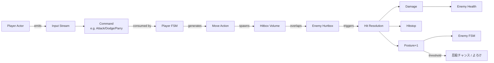

# アクションゲーム テンプレート

## 概要

リアルタイム戦闘 + 移動操作を中核とする 3D / 2D アクションゲーム。
代表作は **SEKIRO**、 **Bayonetta**、 **Devil May Cry**、 **Nioh**、 **Elden Ring** (派生)。

コアループ:

> 入力 → 攻撃 / 回避 → ヒット判定 → ヒット応答 (ヒットストップ・体力減少・スタガー) → 次入力

「気持ち良さ」 (game feel) が成功の鍵。 ヒットストップ・カメラシェイク・i-frame・パリィ受付窓の長さ・敵の硬直値・コンボのキャンセル猶予 — これらの **数値の調律** がそのままゲームの個性になる。

技術的には:
- 60 fps を維持できるシンプルな当たり判定 (AABB / 球 / OBB) + ブロードフェーズ
- アニメーションのキャンセル可能フレームを定義した「フレームデータ」
- カメラの自動追従 + ロックオン
- 敵 AI の限定行動表 (idle / chase / attack pattern / recover)

## 必要不可欠な機能実装

- `[input-buffer]` 入力バッファ — 攻撃 / 回避入力を 100-200ms 保持して次アクションに引き継ぐ
- `[hitbox-system]` 攻撃判定 / 被弾判定の交差検査 (AABB / sphere / OBB)
- `[health-system]` HP コンテナ + ダメージ / 回復 / 死亡コールバック
- `[combo-system]` 連続入力で技をつなげる (cancel window 必須)
- `[dodge-roll]` i-frame を伴う緊急回避
- `[hitstop]` 命中時の時間停止演出 (打撃感)
- `[camera-follow]` 追従カメラ + シェイク
- `[lockon]` (新規) 近接敵をロックして攻撃方向を補正 — SEKIRO / DMC で必須
- `[parry-system]` (新規) 直前ブロックでガード崩し → 敵スタガー
- `[posture-stagger]` (新規) 体幹 / スタガーゲージ。 SEKIRO 直系
- `[enemy-ai-states]` 敵の有限状態機械 (idle / chase / attack / recover / stunned)
- `[stamina-system]` (新規 / 任意) 行動コスト管理。 ダクソ系で必須
- `save-load` チェックポイント方式 (篝火 / 神社) のセーブ

## コアドメイン設計



**境界づけられたコンテキスト**:

| Context | 主な型 |
|---------|--------|
| Player | `PlayerActor`, `PlayerFSM`, `InputBuffer`, `StaminaPool`, `Posture` |
| Enemy | `EnemyActor`, `EnemyFSM`, `AggroState`, `Posture` |
| Combat | `Hitbox`, `Hurtbox`, `HitEvent`, `DamageResolver`, `Hitstop` |
| Camera | `CameraRig`, `LockOnTarget`, `Shake` |
| World | `Checkpoint`, `Region`, `Spawner` |

## 対応するコード設計

Ars アクターモデル上の典型配置 (疑似 Rust + Ergo モジュール):

```rust
// crates/game-action/src/player.rs
pub struct PlayerActor {
    fsm: PlayerFSM,
    input: ergo_input_buffer::Buffer,   // 200ms
    health: ergo_health::Health,        // ergo_health
    posture: Posture,                   // ゲーム固有
    stamina: StaminaPool,
    transform: Transform,
}

impl Actor for PlayerActor {
    fn tick(&mut self, dt: f32, ctx: &mut TickCtx) {
        self.input.tick(dt);
        if let Some(cmd) = self.input.next_command() {
            self.fsm.dispatch(cmd, dt);
        }
        self.fsm.tick(dt, ctx);
        self.posture.regen(dt);
        self.stamina.regen(dt);
        self.health.tick(dt);
    }
}

// crates/game-action/src/combat.rs
pub fn resolve_hit(
    attacker: &mut Combatant,
    defender: &mut Combatant,
    hit: &HitEvent,
) {
    if defender.is_parrying() && hit.is_meleable() {
        defender.posture.add(0);
        attacker.posture.add(hit.parry_punish);
        attacker.fsm.go_to(State::Staggered);
        spawn_parry_vfx(attacker.transform);
        return;
    }
    let dmg = hit.compute_damage(defender);
    defender.health.apply_damage(dmg);
    defender.posture.add(hit.posture_damage);
    spawn_hit_vfx(defender.transform);
    enter_hitstop(hit.hitstop_ms);
}
```

```text
src/
  player/        Actor + FSM + Input
  enemy/         Actor + AI states
  combat/        Hitbox / Hurtbox / Resolver / Hitstop
  camera/        Follow / LockOn / Shake
  world/         Checkpoint / Spawner / Region
```

依存:
- `ergo_health` (HP)
- `ergo_input_buffer` (入力バッファ — game-lexicon §2)
- `ergo_hitbox` (新規想定)
- `ergo_frame` (フレームカウンタ)
- `ergo_world_time` (ヒットストップ用 time-scale)
