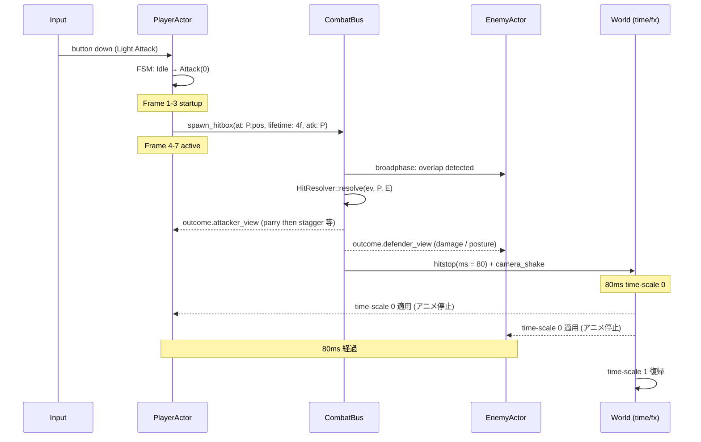

# action — イベントフロー / 同期境界

戦闘 1 ヒットが画面に出るまでの **同期 / 非同期境界** と、 競合するときのルール。

## 1 ヒットのフレーム別フロー

## 同期点 / 非同期点

| 場所 | 同期 / 非同期 | 理由 |
|------|---------------|------|
| FSM 状態遷移 | 同期 (即時) | 入力に対する反応速度を落とせない |
| Hitbox スポーン | 同期 (この frame で見える) | active 開始 frame と完全一致 |
| Broadphase スキャン | 同期 (frame end) | 全アクター tick 完了後 |
| HitResolver | 同期 | 順序確定が必要 |
| VFX / SE 発火 | 非同期 OK | 1 frame 遅れても見えない |
| ヒットストップ | 同期 (即) | 即座に時間が止まる必要がある |
| カメラシェイク | 非同期 OK | 1 frame 遅延は許容 |
| アニメ補間更新 | 描画フレームで | sim とは独立 |

## 競合解決ルール

### ヒット同フレーム多重

- 同じ `(attacker, defender)` 組合せは **1 frame に 1 回だけ** 解決する。
  - キーは `(move_id, attacker_id, defender_id)` でマージ。
- 別 attacker が同時に当てた場合は `attacker_id` 昇順で順次解決。
  - 1 件目のヒットでスタガーすると 2 件目以降の damage も追加で乗る (= スタガー狙いに価値が出る)。

### 入力競合

- attack と parry を同 frame で押した場合は **より硬直の短い** 方 (parry) を優先 → 「咄嗟のパリィ」 を取れるように。
- attack 中に dodge 入力 → キャンセル可能フレーム内なら遷移、 外なら無視。

## ステート保存 (リプレイ / セーブ)

- 戦闘中の state は `Clone + Serialize` を維持。
  - 篝火セーブはこの snapshot を使う。
- 入力ログは `(frame, button, axis)` を記録。
  - 完全リプレイは sim を deterministic に保つ。 浮動小数点を使う場合は `f32` を fixed-step で。

## エッジケース

| ケース | 期待挙動 |
|--------|----------|
| プレイヤーが攻撃の active 中に死亡 | 持続中の hitbox は引き続き active (1 撃道連れ可) |
| 敵がスタガー中にプレイヤーがパリィ | パリィ punish は通常通り適用、 敵スタガー時間延長 |
| ヒットストップ中に新たなヒット発生 | キューイング、 stop 解除後に順次解決 |
| FSM が遷移途中で外部イベント (ボス遷移) | 強制中断 → 外部 cinematic state へ移行 |
