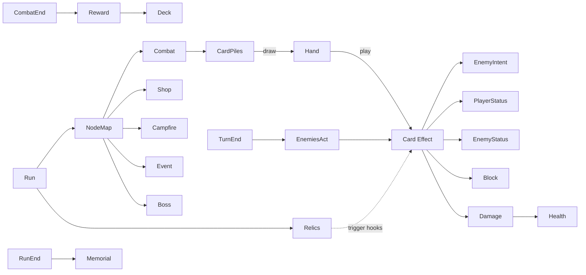

# デッキビルドローグライク テンプレート

## 概要

**Slay the Spire** が確立した「カードゲーム + ノードマップ + 永続死」 ジャンル。 代表作は **Slay the Spire**, **Monster Train**, **Inscryption (一部)**, **Dawncaster**, **Balatro (派生)**。

コアループ:

> マップノード選択 → 戦闘 (カードを引く / プレイ) → 報酬で新カード入手 → 蛇足 / レリック / 焚火 → ボス → 次の章 → 死亡 / 勝利

特徴:

- **デッキ**は 1 ランで動的に膨らむ (10 → 30 枚)
- カード相互の **シナジー設計** が強さの肝 (毒 build / strength build / discard build...)
- **レリック / アーティファクト** = 永続パッシブ。 コンボの起点
- **戦闘** はターン制 + エナジー (毎ターン 3 等) + プレイ → 終了
- **ノードマップ** (上方向に分岐) で道選びがメタ戦略

## 必要不可欠な機能実装

- `[card-pile]` (新規) Deck / Hand / Discard / Exhaust の 4 山を Card 配列で
- `[draw-shuffle]` (新規) drawN / 補充時の shuffle (seeded)
- `[energy]` (新規) ターン頭にリセットされるエナジー
- `[card-effect]` (新規) attack / block / draw / status / power などのカード効果 DSL
- `[targeting]` (新規) self / enemy / random / all / pick
- `[turn-cycle]` (新規) Player draw → play → end → enemies → start of player
- `[enemy-intent]` (新規) 次ターンの行動を「予告」する (Slay the Spire 由来)
- `[health-system]` プレイヤー HP は永続、 戦闘内で削れる。 焚火で全快
- `[block-armor]` (新規) ターン終了で消える防御値
- `[status-power]` (新規) 状態 (Vulnerable, Weak, Poison) + パワー (Strength, Dexterity)
- `[relic]` (新規) 永続パッシブ (戦闘前 / ターン頭 / 攻撃時 etc にトリガ)
- `[node-map]` (新規) DAG 形式の章ごとのマップ (BFS で生成)
- `[reward]` (新規) 戦闘後のカード選択 / ゴールド / レリック
- `[shop]` (新規) ゴールドでカード / レリック / 削除
- `[campfire]` (新規) 全快 / カードアップグレード / 任意イベント
- `[run-record]` (新規) 死亡時の死因 / デッキ状態 + メタ通貨
- `[seeded-rng]` (新規) リプレイ可能 seed
- `[card-database]` (新規) カード定義 (TOML / JSON) — 数百種

## コアドメイン設計



**境界づけられたコンテキスト**:

| Context | 主な型 |
|---------|--------|
| Run | `Run`, `Seed`, `Floor`, `MetaCurrency`, `Memorial` |
| Map | `NodeMap`, `Node (Combat/Shop/Campfire/Boss)`, `Edge` |
| Deck | `CardPile (Deck/Hand/Discard/Exhaust)`, `Card`, `CardDatabase` |
| Combat | `CombatState`, `Energy`, `TurnPhase`, `Block`, `StatusBag`, `PowerBag` |
| Effect | `EffectScript`, `Targeting`, `EffectResolver` |
| Enemy | `EnemyDef`, `Intent`, `EnemyAI`, `EnemyInstance` |
| Relic | `Relic`, `RelicHook (OnPlay, OnTurnStart, OnDamage, ...)` |

## 対応するコード設計

戦闘は **イベントループ** + **小さな effect DSL** が安定する:

```rust
// crates/game-deckbuilder/src/card.rs
#[derive(Clone)]
pub struct Card {
    pub id: CardId,
    pub name: String,
    pub cost: i32,           // -1 = X 消費 / 無消費
    pub effects: Vec<EffectScript>,
    pub kind: CardKind,      // Attack / Skill / Power
    pub upgraded: bool,
}

pub enum EffectScript {
    DealDmg { amount: Val, target: Target },
    GainBlock { amount: Val },
    ApplyStatus { status: StatusKind, amount: Val, target: Target },
    GainEnergy(Val),
    Draw(Val),
    Custom(CustomFn),        // レアな例外用
}

// crates/game-deckbuilder/src/combat.rs
pub struct CombatState {
    pub player: PlayerCombat,
    pub enemies: Vec<EnemyCombat>,
    pub piles: CardPiles,
    pub energy: i32,
    pub turn: u32,
    pub event_log: Vec<CombatEvent>,
}

pub fn play_card(state: &mut CombatState, hand_idx: usize, target: TargetSel) -> Result<()> {
    let card = state.piles.hand.remove(hand_idx);
    if state.energy < card.cost { return Err(NotEnoughEnergy); }
    state.energy -= card.cost;
    for eff in &card.effects {
        resolve_effect(state, eff, target);
    }
    fire_relic_hook(state, RelicHook::OnPlay { card: &card });
    if card.kind == CardKind::Power {
        state.piles.power.push(card);
    } else {
        state.piles.discard.push(card);
    }
    Ok(())
}

// 敵 AI の intent: 次ターンに何をするか「先に見せる」
pub fn enemy_intent(enemy: &EnemyCombat, rng: &mut Rng) -> Intent {
    enemy.def.move_set.choose(rng)
}
```

```text
src/
  run/           Run + NodeMap + Floor + Memorial
  card/          Card definitions + CardDatabase (TOML)
  pile/          Deck / Hand / Discard / Exhaust
  combat/        CombatState + Energy + TurnPhase
  effect/        EffectScript DSL + Resolver
  enemy/         EnemyDef + Intent + AI
  relic/         Relic + RelicHook
  reward/        CardChoice + Gold + Relic drop
  shop/          Pricing + Removal
  campfire/      Rest / Smith
  event/         Map ? events
  ui/            CombatUI + DeckViewer + MapUI + RewardUI
  rng/           Seeded Rng + DeterminismCheck
```

依存:
- `ergo_health` `ergo_input`
- カード定義は **TOML 駆動**にしてバランス調整を非エンジニアでも回せるようにする
