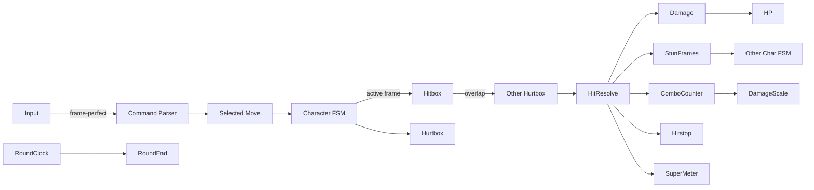

# 格闘ゲーム テンプレート

## 概要

1v1 を基本とする 2D / 3D 格闘ゲーム。 代表作は **Street Fighter**, **Tekken**, **Guilty Gear**, **Mortal Kombat**, **King of Fighters**。

コアループ:

> ラウンド開始 → 間合い管理 → 起き攻め / コンボ / 投げ / ガード → ライフバー減少 → KO で 1 ラウンド勝利 → ベストオブ N で勝者決定

特徴:

- **フレーム精度** が命: 60 fps 固定 + 各技 startup / active / recovery
- 三すくみ: **打撃** vs **投げ** vs **ガード** + 投げ抜けの確定割り込み
- **コンボ** = 硬直差を利用した連続技。 「コンボ補正」 で長すぎないよう減衰
- **画面端コンボ** = 受け側の壁ハメで延長
- **ロールバックネットコード** が品質指標 (近年は MOBA 同様必須)
- 1 試合 30-90 秒 → 短く再戦しやすい

## 必要不可欠な機能実装

- `[command-input]` →↓↘+P 等のコマンド解釈 (記号化 / モーション窓 / 短縮入力許可)
- `[input-buffer]` 入力バッファ
- `[frame-data]` 技ごとの startup / active / recovery / hit-stun / block-stun
- `[hitbox-system]` 攻撃ボックス + 食らいボックス + push ボックス + 投げボックス
- `[guard-throw]` 三すくみ + 投げ抜け
- `[combo-system]` ヒット中はキャンセル可、 補正 (ダメージ減衰 + スケーリング)
- `[health-system]` HP バー
- `[round-system]` ベストオブ N + タイムオーバー判定
- `[hitstop]` 命中で時間停止
- `[super-meter]` (新規) 超必殺ゲージ (攻撃 / 被弾 / ガードで増加)
- `[burst-defense]` (新規 / 任意) ガード不能脱出 (GG 系)
- `[counter-hit]` (新規) 確定反撃時の補正 + ダメージ増
- `[corner-detect]` (新規) 画面端での挙動分岐
- `[character-roster]` (新規) 各キャラのスキル + フレームデータ + ヒットボックス定義
- `[rollback-netcode]` 対人戦のロールバック実装
- `[training-mode]` (新規) 操作・コンボ練習モード
- `[replay]` (新規) 入力ログから完全再生

## コアドメイン設計



**境界づけられたコンテキスト**:

| Context | 主な型 |
|---------|--------|
| Character | `CharacterDef`, `CharacterInstance`, `FSM`, `MoveSet`, `FrameData` |
| Input | `InputFrame`, `CommandParser`, `MotionTable` |
| Combat | `Hitbox`, `Hurtbox`, `PushBox`, `ThrowBox`, `HitResolve` |
| Combo | `ComboCounter`, `DamageScaling`, `HitStunStack` |
| Match | `RoundController`, `MatchResult`, `Stage`, `CornerDetect` |
| Net | `RollbackEngine`, `Snapshot`, `Reconcile` |

## 対応するコード設計

整数演算 + 60Hz 固定 + 全状態シリアライザブル:

```rust
// crates/game-fight/src/character.rs
pub struct CharacterInstance {
    pub def: &'static CharacterDef,
    pub state: StateId,           // Stand / Crouch / Air / Block / HitStun ...
    pub frame_in_state: u16,      // フレームカウンタ (state 内)
    pub hp: i32,
    pub super_meter: i32,
    pub pos: FixedVec2,           // 整数 / 固定小数
    pub vel: FixedVec2,
    pub facing: Facing,
    pub hit_stun: u16,
    pub block_stun: u16,
    pub combo_count: u16,
    pub combo_scale: u16,         // % (100 = 通常)
}

// crates/game-fight/src/move.rs
#[derive(Clone)]
pub struct MoveDef {
    pub name: String,
    pub cmd: CommandPattern,           // ex. "236P"
    pub startup: u16,
    pub active:  u16,
    pub recovery: u16,
    pub hit_stun: u16,
    pub block_stun: u16,
    pub hit_dmg:   i32,
    pub guard_dmg: i32,
    pub hitboxes: Vec<HitboxKey>,      // active 中のフレームごとの形状
    pub cancel_window: Vec<CancelInto>,// このフレーム以降このムーブにキャンセル可
}

// crates/game-fight/src/parser.rs
pub fn parse_command(buffer: &InputBuffer, motions: &MotionTable, current_state: StateId) -> Option<&'static MoveDef> {
    // 例: "236P" = 下 → 下右 → 右 + P 押下、 ms 窓 400 内に成立
    // motions table を新しい順 / 高優先度順で評価
    motions.iter()
        .filter(|m| m.allowed_in(current_state))
        .find(|m| m.matches(buffer))
}

// crates/game-fight/src/combat.rs
pub fn resolve_hit(att: &mut CharacterInstance, def: &mut CharacterInstance, hitbox: &Hitbox) {
    let blocked = def.is_blocking(hitbox);
    if blocked {
        let dmg = scale(hitbox.guard_dmg, def.combo_scale);
        def.hp -= dmg.max(1);                         // 削りダメージ
        def.block_stun = hitbox.block_stun;
    } else {
        let dmg = scale(hitbox.hit_dmg, def.combo_scale);
        def.hp -= dmg;
        def.hit_stun = hitbox.hit_stun;
        def.combo_count += 1;
        def.combo_scale = scaling_after(def.combo_count);
    }
    enter_hitstop(hitbox.hitstop);
    att.super_meter += hitbox.meter_gain_attacker;
    def.super_meter += hitbox.meter_gain_defender;
}
```

```text
crates/
  game-fight-sim/      決定論シム (i32 / 固定小数)
  game-fight-data/     キャラ + 技 + フレームデータ (TOML)
  game-fight-net/      ロールバック + 入力遅延制御
  game-fight-replay/   入力ログ + ステップ再生
  game-fight-train/    トレモ (フレーム可視化 / 入力履歴)
  game-fight-client/   描画 + UI
```

依存:
- `ergo_health`
- 60 Hz 固定 tick + すべての state を `Clone + Serialize` にする (ロールバック前提)
