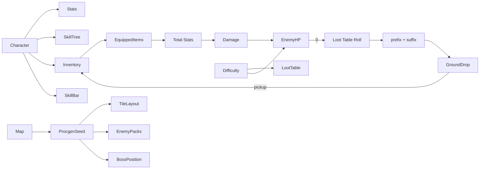

# ハクスラ (Hack & Slash ARPG) テンプレート

## 概要

俯瞰視点の **Loot 駆動アクション RPG**。 代表作は **Diablo 1/2/3/4**, **Path of Exile**, **Grim Dawn**, **Last Epoch**, **Torchlight**。

コアループ:

> 進入 → モブ大量虐殺 → アイテムドロップ → 装備更新 → ボス → 次の難度 / 次のマップ → 倒した敵から良いアイテム → endless

特徴:

- **ランダム化アイテム** (rarity, prefix/suffix mod, ilvl) が中心動機
- **クラス + ビルド** (スキルツリー / ジェム / クラフト)
- マップは**毎回プロシージャル**生成 (PoE は「マップアイテム」 = 1 マップ単位)
- 「**画面外まで埋まる敵**」 + AOE スキル + パーティクル爆発
- 装備の **比較 UI** + ストレージ 管理 が重要 (大量に拾うため)

## 必要不可欠な機能実装

- `[character-class]` (新規) Barbarian / Sorceress / ... + 専用ステ + スキルツリー
- `[skill-tree]` (新規) パッシブ + アクティブのノード DAG
- `[stat-system]` HP / mana / armor / damage + 多数の secondary (resist / fr / cr / ...)
- `[loot-table]` (新規) 敵 ID + 場所 + ilvl からのドロップ確率表
- `[item-mods]` (新規) prefix / suffix / implicit + 階層 (rarity)
- `[item-rarity]` (新規) Normal / Magic / Rare / Unique / Legendary / Set
- `[stash]` (新規) 大容量ストレージ (タブ / 検索)
- `[inventory]` グリッド型 (Diablo 2 系) または重量型
- `[crafting]` (新規) リロール / 強化 / アップグレード
- `[skill-bar]` (新規) アクティブスキル N 個割当 (左右クリック + 1-9)
- `[ground-loot]` (新規) ドロップアイテムが地面に表示 (label) / ピックアップ
- `[procgen-map]` (新規) マップタイル / 装飾 / 敵パック / ボス位置の手続き生成
- `[difficulty-tiers]` (新規) Normal / Nightmare / Hell / Torment ...
- `[currency]` ゴールド + 専用通貨 (Orb of Alchemy 等)
- `[party-coop]` (新規 / 任意) 4 人マルチ (ホスト / クライアント)
- `[seasons]` (新規 / 任意) 期間制リーダーボード / 専用ビルド

## コアドメイン設計



**境界づけられたコンテキスト**:

| Context | 主な型 |
|---------|--------|
| Character | `Character`, `Class`, `SkillTree`, `Stats`, `SkillBar`, `Inventory`, `Stash` |
| Skill | `SkillDef`, `Active vs Passive`, `Rank`, `JewelSlot` |
| Item | `ItemBase`, `ModRoll`, `Affix`, `Rarity`, `ImplicitMod`, `Sockets` |
| Loot | `LootTable`, `MonsterFamily`, `Rarity weights`, `MagicFind` |
| Map | `MapDef`, `ProcgenSeed`, `Tile`, `EnemyPack`, `Boss` |
| Crafting | `Currency`, `CraftRecipe`, `Modifier` |
| Run / Difficulty | `Difficulty`, `Tier`, `MapModifiers` |

## 対応するコード設計

```rust
// crates/game-hns/src/item.rs
pub struct ItemRoll {
    pub base: ItemBase,
    pub ilvl: u16,
    pub rarity: Rarity,
    pub prefixes: Vec<ModRoll>,    // up to 3
    pub suffixes: Vec<ModRoll>,    // up to 3
    pub implicit: Option<ModRoll>,
    pub sockets:  Vec<Socket>,
}

pub fn roll_item(rng: &mut Rng, base: ItemBase, ilvl: u16, rarity: Rarity, modpool: &ModPool) -> ItemRoll {
    let mut item = ItemRoll {
        base, ilvl, rarity,
        prefixes: vec![], suffixes: vec![],
        implicit: base.implicit_mod.clone(),
        sockets: roll_sockets(rng, base, ilvl),
    };
    let (n_prefix, n_suffix) = match rarity {
        Rarity::Normal => (0, 0),
        Rarity::Magic  => (rng.range(0..=1), rng.range(0..=1)),
        Rarity::Rare   => (rng.range(1..=3), rng.range(1..=3)),
        Rarity::Unique => return roll_unique(rng, base, ilvl),
    };
    for _ in 0..n_prefix {
        let m = modpool.pick(rng, ModSlot::Prefix, base.tags(), ilvl);
        item.prefixes.push(m.roll(rng));
    }
    for _ in 0..n_suffix {
        let m = modpool.pick(rng, ModSlot::Suffix, base.tags(), ilvl);
        item.suffixes.push(m.roll(rng));
    }
    item
}

// crates/game-hns/src/stats.rs
//
// 装備 + パッシブ + バフを集計して「現在の合計ステ」 を出す。
// 計算は乗算・加算の順序ルールを厳密に定義する (PoE 流の "more / increased / added")。
pub struct ComputedStats {
    pub max_hp: i64,
    pub damage_per_hit: f64,
    pub crit_chance: f32,
    // ...
}

pub fn compute_stats(c: &Character, eq: &EquippedSet, buffs: &[Buff]) -> ComputedStats {
    ...
}
```

```text
src/
  character/     Character + Class + SkillTree + Stats compute
  skill/         SkillDef + Active / Passive + JewelSlot
  item/          ItemBase + ModRoll + Roller + Affix DB
  loot/          LootTable + MagicFind
  inventory/     Grid layout + Stash tabs + Search
  craft/         Currency + Recipe
  map/           MapDef + ProcgenSeed + Tile + Pack
  enemy/         Family + Pack + Boss + ElitePacks
  difficulty/    DifficultyTier + MapModifier
  party/         CoopHost + ClientSync
  ui/            ItemTooltip + Comparator + StashUI + SkillTreeUI
```

依存:
- `ergo_health`
- アイテム mod プールは **TOML 管理** + バランスシートから生成
- 装備変更時の stats 再計算は dirty フラグでバッチ化
