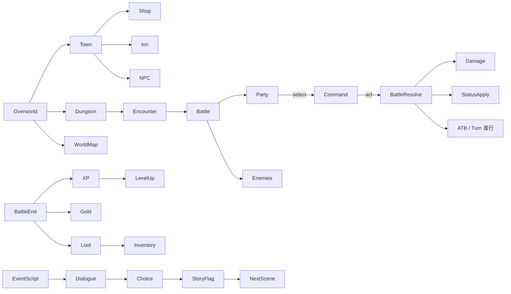

# JRPG (ストーリードリブン) テンプレート

## 概要

ターン制 / ATB / CTB のコマンドバトル + 物語進行。 代表作は **Dragon Quest**, **Final Fantasy IV-IX**, **Persona 4/5**, **Octopath Traveler**, **Bravely Default**。

コアループ:

> 街 / イベント → ダンジョン探索 (エンカウント) → 戦闘 (コマンド選択) → 経験値 + アイテム → レベルアップ + 装備 → 次のイベントへ

特徴:

- **シナリオが主役**。 イベント (会話 + 演出 + 選択肢) のスクリプティングが中心
- **パーティ** (3-4 人) を切り替えて戦う。 役割分担 (タンク / DPS / ヒーラー / バッファー)
- **戦闘は別画面** (背景がフェードして戦闘 BG に切替) もあり、 シームレス (Tales 系) もあり
- **装備** + **スキル習得** (経験値 / SP / ジョブシステム)
- **クラフト / 合成** + **裏ボス** + **ミニゲーム** で長尺化

## 必要不可欠な機能実装

- `[command-battle]` ATB / Turn / CTB の戦闘ループ
- `[stat-system]` HP / MP / 攻 / 防 / 速 / 知 / 運 + 属性耐性 + 状態耐性
- `[party-system]` (新規) 3-4 名のパーティ + リザーブ
- `[skill-learning]` (新規) Lv up / SP / ジョブで習得
- `[equipment-slots]` (新規) 武器 / 防具 / 装飾品 + 個別ステ補正
- `[status-effect]` (新規) 毒 / 麻痺 / 沈黙 / 混乱 / バフ + ターン経過減衰
- `[elemental-affinity]` (新規) 弱点 / 耐性 / 無効 / 吸収
- `[encounter]` (新規) ランダム / シンボルエンカウント
- `[dialogue-system]` 会話 + 選択肢 + 分岐
- `[event-script]` (新規) イベントシーンの演出スクリプト (テキスト / カメラ / SE)
- `[quest-system]` メイン + サイドクエスト
- `[inventory]` アイテム + 装備 + キーアイテム
- `[shop]` (新規) 売買 + 在庫
- `[crafting]` (新規 / 任意) 合成 / 強化
- `[save-load]` 任意セーブ + オートセーブ
- `[level-up-screen]` レベルアップ + 習得スキル表示
- `[overworld]` (新規) 街 / 世界マップ / ダンジョン

## コアドメイン設計



**境界づけられたコンテキスト**:

| Context | 主な型 |
|---------|--------|
| Party | `Character`, `Job`, `Stats`, `Equipment`, `SkillSet`, `Reserve` |
| Battle | `BattleState`, `Combatant`, `Command`, `ATBClock`, `BattleRng` |
| Effect | `Status`, `Buff`, `Element`, `DamageFormula` |
| World | `Town`, `Dungeon`, `WorldMap`, `EncounterTable` |
| Script | `Event`, `Choice`, `Flag`, `Cutscene` |
| Inventory | `Item`, `Equipment`, `KeyItem`, `Stack` |
| Quest | `Quest`, `QuestStep`, `Tracker` |
| Save | `SaveSlot`, `Snapshot`, `AutoSave` |

## 対応するコード設計

戦闘とフィールドは独立したシステムにする (が同じ Character を参照):

```rust
// crates/game-jrpg/src/character.rs
pub struct Character {
    pub id: CharId,
    pub name: String,
    pub level: u16,
    pub xp: u64,
    pub stats: Stats,                // ベース値
    pub equipment: Equipment,
    pub skills: Vec<SkillId>,        // 習得済み
    pub statuses: StatusBag,
    pub current_hp: i32,
    pub current_mp: i32,
}

impl Character {
    pub fn effective_stats(&self) -> Stats {
        let mut s = self.stats.clone();
        s.add(self.equipment.modifiers());
        s.add(self.statuses.modifiers());
        s
    }
}

// crates/game-jrpg/src/battle.rs
//
// ATB: 各キャラに 0..1000 の ATB ゲージがあり、 速さに応じて貯まり、
// 1000 に達したら命令選択画面が出る、 が古典 ATB のモデル。
pub struct BattleState {
    pub party:   Vec<CombatantId>,
    pub enemies: Vec<CombatantId>,
    pub combat:  HashMap<CombatantId, Combatant>,
    pub atb:     HashMap<CombatantId, u16>,     // 0..1000
    pub turn_queue: VecDeque<CombatantId>,
    pub log: Vec<BattleEvent>,
    pub rng: SeededRng,
}

pub fn tick_atb(state: &mut BattleState, dt_ms: u32) {
    for (id, c) in &state.combat {
        if !c.alive() { continue; }
        let speed = c.character.effective_stats().speed;
        let inc = ((speed as u32 * dt_ms) / 100) as u16;
        let v = state.atb.entry(*id).or_insert(0);
        *v = (*v + inc).min(1000);
        if *v >= 1000 && !state.turn_queue.contains(id) {
            state.turn_queue.push_back(*id);
        }
    }
}

pub fn execute_command(state: &mut BattleState, by: CombatantId, cmd: Command) {
    let actor = state.combat.get(&by).unwrap();
    match cmd {
        Command::Attack(target) => {
            let dmg = damage_formula(&state, by, target);
            state.combat.get_mut(&target).unwrap().character.current_hp -= dmg;
            state.log.push(BattleEvent::Damage { by, target, dmg });
        }
        Command::Skill(skill_id, target) => skill::resolve(state, by, skill_id, target),
        Command::Item(item_id, target) => item::use_in_battle(state, by, item_id, target),
        Command::Defend => state.combat.get_mut(&by).unwrap().defending = true,
        Command::Run => try_escape(state, by),
    }
    state.atb.insert(by, 0);
}

// crates/game-jrpg/src/script.rs
//
// イベントスクリプトは外部 DSL (Lua / Rhai / 独自 YAML) が無難。
// 進行は state machine + 各 Step を駆動する Director に任せる。
pub enum EventStep {
    Show { speaker: String, line: String },
    Choose { options: Vec<String> },
    Camera { ... },
    Wait { ms: u32 },
    SetFlag { name: String, value: bool },
    SpawnBattle { enemies: Vec<EnemyId> },
    Move { actor: ActorRef, to: Coord },
}
```

```text
src/
  character/     Character + Job + Stats + Equipment
  party/         Party + Reserve + Formation
  battle/        BattleState + ATB + Command + Resolver
  skill/         Skill DB + Resolver
  status/        StatusEffect + StatusBag
  field/         Town + Dungeon + WorldMap + Encounter
  script/        EventScript runner (Lua / 独自)
  dialogue/      Window + Choice + AutoText
  inventory/     Item + Equipment + KeyItem
  quest/         Quest + Step + Tracker
  shop/          Inventory + Pricing
  save/          Snapshot + AutoSave
  ui/            BattleUI / FieldUI / MenuUI
```

依存:
- `ergo_health` `ergo_input`
- スクリプトは Lua / Rhai が現実解 — でも独自 YAML DSL で 80% カバー可
