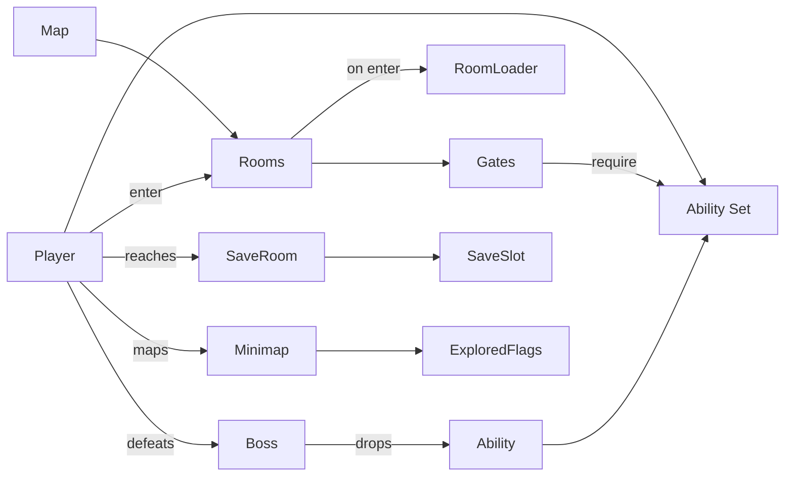

# メトロイドヴァニア テンプレート

## 概要

「能力解放で行ける場所が広がる」 探索型 2D アクション。 代表作は **Super Metroid**, **Castlevania: Symphony of the Night**, **Hollow Knight**, **Ori and the Will of the Wisps**, **Blasphemous**。

コアループ:

> 探索 → 行き止まり (能力不足) → ボス / 隠し部屋 → 新能力 (二段ジャンプ / ダッシュ / 壁張り付き) → 既存ステージで通れなかった場所が解放 → さらに探索

特徴:

- **シームレス相互接続マップ** (loading 無しのエリア遷移、 部屋単位の遅延 load も可)
- **能力ロックゲート** が中心: 物理的に通れない壁・床・ピット
- **ボス戦** + **隠し** の連鎖。 探索の動機 = 報酬 (能力 / 体力タンク / マナ)
- 100% コンプを目指す上級層と、 メイン進行で十分な層、 両方を満たす設計
- **マップ画面** (ミニマップ) が UX の半分

## 必要不可欠な機能実装

- `[player-controller-2d]` プラットフォーマー基礎 + 拡張能力
- `[ability-system]` (新規) 取得済み能力フラグ (二段 / ダッシュ / 壁ジャンプ / 反射弾 ...)
- `[gate-trigger]` (新規) 「特定能力を要求」 する地形ゲート
- `[interconnected-rooms]` (新規) 部屋単位ロード + 相互シームレス遷移
- `[minimap-system]` (新規) 探索済 / 未探索 / セーブポイント / アイテムを表示
- `[save-room]` (新規) 限定地点でのセーブ + 全快
- `[boss-fight]` (新規) ボスごとのフェーズ移行 + 専用 BGM + アリーナ閉鎖
- `[health-system]` HP コンテナ + ハート / タンク 拡張
- `[mp-resource]` (新規 / 任意) 魔法 / 能力使用に消費する追加リソース
- `[secret-detect]` (新規) 偽壁 / 隠し床のフラグ管理
- `[item-pickup]` (新規) 永続効果アイテム (ダブルジャンプ取得 etc)
- `[lore-collectible]` (新規) ロアテキスト断片 (Hollow Knight の Hunter's Journal 等)
- `[fast-travel]` 任意 — 能力アンロック後に解放されるテレポーター

## コアドメイン設計



**境界づけられたコンテキスト**:

| Context | 主な型 |
|---------|--------|
| Player | `PlayerActor`, `AbilityFlags`, `HealthTanks`, `Mana` |
| World | `WorldMap`, `Room`, `RoomTransition`, `Gate`, `SaveRoom` |
| Combat | `EnemyDef`, `EnemyInstance`, `Boss`, `Phase`, `Aggro` |
| Progression | `AbilityDef`, `Pickup`, `Secret`, `LoreEntry` |
| UI | `Minimap`, `AbilityListUI`, `BossHUD` |

## 対応するコード設計

```rust
// crates/game-mvania/src/ability.rs
bitflags! {
    pub struct AbilityFlags: u64 {
        const DOUBLE_JUMP    = 1 << 0;
        const DASH           = 1 << 1;
        const WALL_JUMP      = 1 << 2;
        const SUPER_MISSILE  = 1 << 3;
        const SHINESPARK     = 1 << 4;
        const FAST_TRAVEL    = 1 << 5;
        // ...
    }
}

// crates/game-mvania/src/gate.rs
pub struct Gate {
    pub pos: Coord,
    pub kind: GateKind,            // ColorBlock / IceWall / VineGrowth ...
    pub require: AbilityFlags,
}

impl Gate {
    pub fn can_pass(&self, abilities: AbilityFlags) -> bool {
        abilities.contains(self.require)
    }
}

// crates/game-mvania/src/world.rs
pub struct WorldMap {
    pub rooms: HashMap<RoomId, RoomDef>,
    pub edges: Vec<RoomEdge>,       // 部屋接続 (ドア / トランジション)
    pub gates: Vec<Gate>,
    pub current_room: RoomId,
    pub explored: HashSet<RoomId>,
}

pub fn enter_room(world: &mut World, dest: RoomId, from_edge: EdgeId) {
    let prev = world.map.current_room;
    world.unload_room(prev);
    world.load_room(dest);
    world.map.current_room = dest;
    world.map.explored.insert(dest);
    world.minimap.mark_explored(dest);
}
```

```text
src/
  player/        Controller (extends platformer) + Ability use
  ability/       AbilityFlags + AbilityUnlocks
  world/         WorldMap + Room + RoomEdge + Gate
  enemy/         Enemy / Boss / Phase
  saveroom/      SavePoint + Restoration
  minimap/       Minimap state + render
  pickup/        AbilityPickup / HealthTank / Lore
  ui/            BossHUD + InventoryUI + LoreReader
```

依存:
- `[platformer]` 基礎を使い回す
- `ergo_health` `ergo_input`
- 部屋ロード戦略は **room-streaming** (現在 + 隣接 N 部屋を常駐) が安定する
