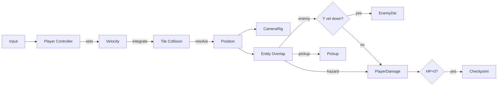

# プラットフォーマー テンプレート

## 概要

スーパーマリオ系の **2D / 2.5D 横スクロールプラットフォーマー**。 代表作は **Super Mario Bros**, **Celeste**, **Hollow Knight (横移動部分)**, **Super Meat Boy**。

コアループ:

> 移動 → ジャンプ → 着地 → ギミック (敵 / 障害 / 取得物) → 次のセクション

技術的な注意:

- **ジャンプの曲線** が遊び味を決める。 上昇加速度・落下加速度・短押しキャンセル・"coyote time" (足場を踏み外しても 100ms はジャンプ可) の調整が肝
- 床 / 壁 / 天井の **タイル衝突解像** (sweep + slide) を 1px 精度で
- 敵接触は普通の hitbox、 ギミック (バネ・敵を踏む) は別パスで判定
- スクロール / カメラは **デッドゾーン + look-ahead** が定番

## 必要不可欠な機能実装

- `[player-controller-2d]` (新規) 加速度ベースの 2D 移動 + 着地判定
- `[jump-physics]` (新規) 可変高さジャンプ + coyote time + jump buffer
- `[tile-collision]` (新規) AABB vs タイルマップ sweep & slide
- `[hitbox-system]` 敵接触判定
- `[stomp-detect]` (新規) 上から踏んだか横から触れたかの判定 (上下方向の相対速度 + Y 距離)
- `[health-system]` HP (3 機制 / ハート制)
- `[respawn-system]` (新規) チェックポイント / 即時リスポーン
- `[camera-2d-follow]` (新規) デッドゾーン + look-ahead カメラ
- `[parallax-bg]` (新規) 多層スクロール背景
- `[pickup-system]` コイン / アイテム取得
- `[level-loader]` (新規) Tiled / Aseprite / 独自フォーマットのステージロード

## コアドメイン設計



**境界づけられたコンテキスト**:

| Context | 主な型 |
|---------|--------|
| Player | `PlayerActor`, `PlayerState (Idle/Run/Jump/Fall)`, `JumpBuffer`, `CoyoteTimer` |
| World | `TileMap`, `Layer`, `Checkpoint`, `Spawner` |
| Entity | `Enemy`, `Pickup`, `Hazard`, `MovingPlatform` |
| Camera | `Camera2D`, `DeadZone`, `LookAhead` |

## 対応するコード設計

```rust
// crates/game-platformer/src/player.rs
pub struct PlayerActor {
    state: PlayerState,
    pos: Vec2,
    vel: Vec2,
    grounded: bool,
    coyote: f32,            // 残り coyote time (秒)
    jump_buffer: f32,       // 残り入力先行受付 (秒)
    health: ergo_health::Health,
}

impl Actor for PlayerActor {
    fn tick(&mut self, dt: f32, ctx: &mut TickCtx) {
        // 1. 入力読み込み
        let i = ctx.input;
        let want_jump = i.pressed(Btn::A);
        let xaxis = i.axis(Axis::Hori);

        // 2. 横移動 (加速度 + 摩擦)
        let target_vx = xaxis * MOVE_SPEED;
        self.vel.x = approach(self.vel.x, target_vx, ACCEL * dt);

        // 3. ジャンプ
        if want_jump { self.jump_buffer = 0.1; }
        if self.jump_buffer > 0.0 && (self.grounded || self.coyote > 0.0) {
            self.vel.y = JUMP_VEL;
            self.jump_buffer = 0.0;
            self.coyote = 0.0;
        }
        // 短押しキャンセル
        if !i.held(Btn::A) && self.vel.y > JUMP_VEL * 0.4 {
            self.vel.y *= 0.5;
        }

        // 4. 重力
        self.vel.y += GRAVITY * dt;

        // 5. 衝突解像 — sweep + slide
        let (new_pos, hit) = ctx.tilemap.sweep(self.pos, self.vel * dt, AABB_SIZE);
        self.pos = new_pos;
        self.grounded = hit.bottom;
        if hit.bottom { self.vel.y = 0.0; self.coyote = 0.1; }
        else { self.coyote -= dt; }
        if hit.top    { self.vel.y = 0.0; }

        // 6. 取得 / 接触判定はオーバーラップフェーズで別途
    }
}
```

```text
src/
  player/        Controller + State + Animation
  world/         TileMap + Checkpoint + Spawner
  entity/        Enemy / Pickup / Hazard / MovingPlatform
  camera/        Camera2D + DeadZone + Lookahead
  level/         Loader (Tiled JSON or 独自)
```

依存:
- `ergo_health` `ergo_input` `ergo_frame`
- 物理は自前 (`tile-collision` モジュール) — 重い物理エンジンは要らない
