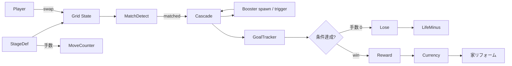

# パズル / カジュアル テンプレート

## 概要

3-match / blast 系のステージ制カジュアルパズル。 代表作は **Royal Match**, **Candy Crush Saga**, **Toon Blast**, **Gardenscapes**。

コアループ:

> ステージ開始 → 限定手数 / 時間 → グリッドで連結消去 → 連鎖カスケード → 目標達成 / 失敗 → メタ画面 (家リフォーム / ライフ / コイン)

特徴:

- **手数制 + 目標条件**: 「氷をすべて割る」 「ジェムを N 個集める」 など
- **連鎖カスケード**: 消去 → 落下 → 補充 → 再連結チェック の繰り返しで気持ち良さを作る
- **特殊ピース** (ロケット / バクダン / 虹) の生成ルールが戦略の中心
- **ライフ / コイン / ブースター** の **メタゲーム** + **広告 / IAP** が事業として必須
- 1 ステージ = 数十秒〜数分。 **数千ステージ** の大規模手作り

## 必要不可欠な機能実装

- `[grid-puzzle]` (新規) NxM グリッドにピース配置
- `[match-detect]` (新規) 同色 3+ 連結検出 (横 / 縦 / L / T 形)
- `[cascade-resolve]` (新規) 消去 → 重力落下 → 補充 → 再検査の駆動
- `[booster-piece]` (新規) ロケット / 爆弾 / 虹 / 縞 の生成 + 効果伝播
- `[move-counter]` (新規) 残り手数 + ボーナス判定
- `[goal-tracker]` (新規) ステージ目標 (氷 N / ジェム N / アイテム持ち出し)
- `[stage-loader]` (新規) 数千ステージ定義の効率的ロード (LRU)
- `[life-system]` (新規) ライフ (5 個 / 30 分回復) + 友人ギフト
- `[currency]` (新規) コイン + 課金通貨
- `[booster-inventory]` (新規) ステージ前 / 中に使う消費アイテム
- `[meta-progression]` 家 / 庭のリフォーム進行 (Gardenscapes 系)
- `[ads-iap]` (新規) リワード広告 / IAP 統合
- `[push-retention]` (新規) ライフ満タン / 友人プレイ時のプッシュ通知
- `[analytics]` (新規) ステージ離脱率 / 平均試行回数 (チューニング必須)

## コアドメイン設計



**境界づけられたコンテキスト**:

| Context | 主な型 |
|---------|--------|
| Stage | `StageDef`, `GoalSet`, `MoveBudget`, `Grid<Piece>` |
| Match | `MatchDetector`, `MatchGroup`, `BoosterRule` |
| Cascade | `CascadeStep`, `Gravity`, `Refill`, `EffectQueue` |
| Meta | `LifePool`, `Currency`, `BoosterInventory`, `RenovationProgress` |
| Service | `IAP`, `Ads`, `PushScheduler`, `Analytics` |

## 対応するコード設計

```rust
// crates/game-puzzle/src/grid.rs
pub struct Grid {
    pub w: u8,
    pub h: u8,
    pub cells: Vec<Cell>,    // length = w*h, row-major
}

#[derive(Clone, Copy)]
pub struct Cell {
    pub piece: Piece,
    pub blocker: Option<Blocker>,   // 氷 / ゼリー / 鎖
}

impl Grid {
    /// 隣接スワップ後に match があるか? (= valid swap か)
    pub fn try_swap(&mut self, a: Coord, b: Coord) -> bool {
        self.swap(a, b);
        let m = self.find_matches();
        if m.is_empty() { self.swap(a, b); false } else { true }
    }

    /// 一連のカスケードを progressing-step で返す (アニメ駆動用)
    pub fn cascade(&mut self) -> impl Iterator<Item = CascadeStep> + '_ {
        std::iter::from_fn(move || {
            let m = self.find_matches();
            if m.is_empty() { return None; }
            let step = self.apply_matches(m);
            self.gravity();
            self.refill();
            Some(step)
        })
    }
}

// crates/game-puzzle/src/booster.rs
pub fn trigger_rocket(g: &mut Grid, at: Coord, dir: Dir) -> Vec<Coord> {
    // 横 / 縦に並んだセルをすべて消す。 巻き込みで他 booster も発火
    ...
}
```

```text
src/
  grid/          Grid + Cell + Coord
  match/         MatchDetector + MatchGroup
  cascade/       Gravity + Refill + Effect resolution
  booster/       Rocket / Bomb / Rainbow / Stripe rules
  stage/         StageDef + GoalSet + Loader (lazy chunks)
  meta/          Life + Currency + Renovation
  ui/            BoardRenderer + ParticleEffects + ResultPanel
  services/      IAP / Ads / Push / Analytics
```

依存:
- `ergo_score` (任意 — 一般的にステージ内スコアは固有)
- `ergo_io` (大量ステージファイル管理)
- 連鎖アニメは「論理 step → 描画 step」 の二段プレイバックが定石
