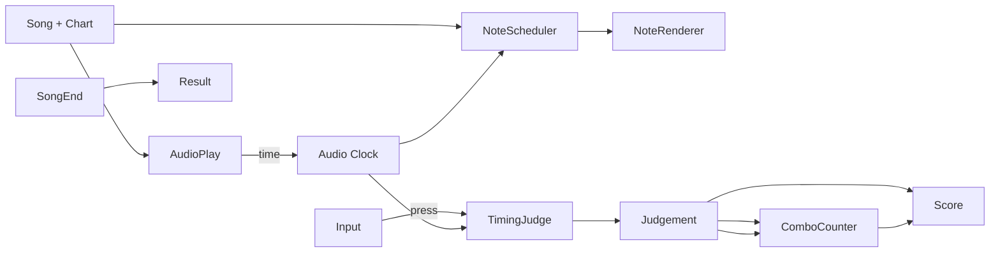

# 音ゲー (リズム) テンプレート

## 概要

音楽に合わせてノーツを叩く。 代表作は **Beatmania IIDX**, **Dance Dance Revolution**, **Project DIVA**, **osu!**, **Cytus**, **Project Sekai**。

コアループ:

> 楽曲選択 → 譜面プレイ → タイミング判定 (PERFECT/GREAT/GOOD/MISS) → コンボ → スコア → リザルト → 次曲

特徴:

- **オーディオとビジュアルの厳密同期** (ms 単位)
- **ローレイテンシ入力** (タッチ / ボタン → 判定まで 16ms 以内が理想)
- **譜面エディタ** がコンテンツの命綱 (内製 + コミュニティ)
- **キャリブレーション** (ユーザー環境ごとのオフセット調整) 必須
- **判定窓** の数値が体感を決める (PERFECT 25ms / GREAT 60ms / GOOD 120ms 等)
- 1 曲 1.5-3 分。 セッションは 5-30 曲

## 必要不可欠な機能実装

- `[song-database]` (新規) 楽曲メタ + 譜面 + 音源 + ジャケット
- `[note-chart]` 譜面ファイル (json / toml / osu / bms / sm)
- `[chart-loader]` (新規) 各種フォーマットからの読込
- `[audio-engine]` (新規) 低遅延再生 (ASIO / WASAPI / Core Audio / OpenSL ES)
- `[audio-sync]` 音声同期 + ユーザーオフセット (audio offset / video offset)
- `[timing-judge]` ms 窓判定 (PERFECT/GREAT/GOOD/MISS)
- `[input-lowlatency]` (新規) OS native ホットパス (キーボード / タッチ / 専用デバイス)
- `[combo-counter]` コンボ + フルコンボ判定
- `[score-system]` 加点 + 倍率 + ランク (S/A/B/C/D)
- `[note-renderer]` (新規) 高精度描画 (4ms 単位以下のジッタ許容しない)
- `[lane-system]` (新規) レーン (4 / 5 / 6 / 7 / 16 など) + キーマップ
- `[note-types]` (新規) Tap / Hold / Slide / Flick / Bomb / Mash etc
- `[bpm-changes]` (新規) 譜面途中の BPM / オフセット変化
- `[result-screen]` (新規) スコア / 判定数 / コンボ / グラフ
- `[chart-editor]` (新規 / 任意) 内製エディタ
- `[song-select-ui]` (新規) ジャンル / 難易度 / レベル別ソート + プレビュー再生

## コアドメイン設計



**境界づけられたコンテキスト**:

| Context | 主な型 |
|---------|--------|
| Song | `SongDef`, `ChartDef`, `Difficulty`, `BpmChanges` |
| Audio | `AudioEngine`, `Clock`, `Track`, `OffsetConfig` |
| Note | `Note`, `NoteKind`, `NoteScheduler` |
| Input | `LowLatencyInput`, `LaneMapping` |
| Judge | `TimingWindows`, `JudgeResult`, `JudgeStream` |
| Score | `Score`, `RankCurve`, `Combo`, `FullCombo` |
| Library | `SongDatabase`, `Filter`, `Sort`, `Preview` |

## 対応するコード設計

オーディオクロックを source of truth に:

```rust
// crates/game-rhythm/src/clock.rs
//
// 描画フレームには依存しない。 オーディオデバイスから取った再生位置を
// 「ゲーム時刻」 とする。 これに user_offset (ms) を加算した値を判定 / 描画
// 双方が参照する。
pub struct AudioClock {
    pub now_ms_raw: i64,         // オーディオデバイス由来
    pub user_offset_ms: i32,     // 設定で調整
    pub video_offset_ms: i32,    // モニタ遅延補正
}

impl AudioClock {
    pub fn now_for_judge(&self) -> i64 { self.now_ms_raw + self.user_offset_ms as i64 }
    pub fn now_for_render(&self) -> i64 { self.now_ms_raw + self.video_offset_ms as i64 }
}

// crates/game-rhythm/src/judge.rs
// (ergo_timing_judge をそのまま使える — 判定窓 + breaks_combo)

// crates/game-rhythm/src/scheduler.rs
//
// 譜面ノートを「いま判定圏内」 「いま描画圏内」 に分けて Vec で持つ。
pub struct NoteScheduler {
    pub all: Vec<Note>,           // 譜面 ID 順 (時刻昇順)
    pub head_judge: usize,        // 判定窓 in/out 用カーソル
    pub head_render: usize,       // 描画窓 (look-ahead) 用カーソル
}

impl NoteScheduler {
    pub fn judge_window(&self, now_ms: i64, win_ms: i64) -> &[Note] {
        // self.all[head_judge ..] のうち now_ms - win_ms ~ now_ms + win_ms を返す
        ...
    }
}

// crates/game-rhythm/src/play.rs
pub fn on_input(state: &mut PlayState, lane: u8) {
    let now = state.clock.now_for_judge();
    let candidates = state.scheduler.judge_window(now, state.windows.good_ms as i64);
    // この lane で「最も近い」未判定ノートを 1 件選ぶ
    let target = pick_closest(candidates, lane);
    let Some(note) = target else { return };
    let j = ergo_timing_judge::judge(note.target_ms, now, &state.windows);
    state.score.add(score_for(j));
    if breaks_combo(j, state.combo_break_threshold) {
        state.combo.break_();
    } else {
        state.combo.hit();
    }
    note.judged = Some(j);
}
```

```text
crates/
  game-rhythm-core/    Clock + NoteScheduler + Play
  game-rhythm-audio/   低遅延 audio engine + ASIO/WASAPI bind
  game-rhythm-chart/   ChartDef + Loader (osu/bms/sm/独自)
  game-rhythm-data/    SongDatabase + Library
  game-rhythm-input/   LowLatencyInput
  game-rhythm-render/  Note 描画 (高精度)
  game-rhythm-edit/    エディタ (任意)
```

依存:
- `ergo_timing_judge` (このまま使える)
- `ergo_combo_counter` (フルコンボ判定込み)
- `ergo_score`
- `ergo_input` (ただしホットパスは OS native の方が遅延低い)
- 音声バックエンドだけは外部依存 (FMOD / ASIO / etc)
