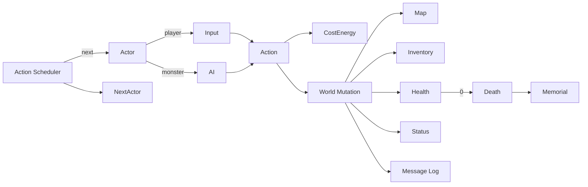

# ローグライク (ベルリン解釈) テンプレート

## 概要

**ベルリン解釈** に従う「真の」ローグライク。 代表作は **NetHack**, **Dungeon Crawl Stone Soup**, **Caves of Qud**, **Brogue**, **ToME**。

ベルリン解釈の主要素 (高基準):

1. **手続き的生成** — ステージは毎回違う
2. **永続死** (パーマデス) — 死ねば 1 周終了
3. **ターン制 + グリッドベース**
4. **複雑性** (アイテム / モンスターの多様な相互作用)
5. **資源管理** (HP / MP / 食料 / 巻物 ...)
6. **ハック&スラッシュ的戦闘** (近接 + 魔法)
7. **探索 / 発見** (アイテム識別、 マップ open)
8. **シングルプレイヤー / シングルキャラクター**

低基準 (任意): ASCII 表示 / 単一キャラ / 視認システム / 床数枚分の階層 / 数値演算ベース

コアループ:

> 1 ターン分の入力 → プレイヤー行動 → モンスター AI ターン → ステータス効果適用 → 死亡判定 → 次ターン

## 必要不可欠な機能実装

- `[turn-engine]` (新規) energy cost 制 (全アクションが「重さ」を持ち、 速さでターン頻度が変わる)
- `[procgen-dungeon]` (新規) 部屋 + 通路生成 (BSP / cellular automata / 独自)
- `[fov]` (新規) 視界計算 (シャドウキャスト / RPS)
- `[grid-actor]` (新規) セルに乗る Actor (player / monster / item)
- `[health-system]` HP + 状態異常 (毒 / 麻痺 / 混乱 ...)
- `[hunger]` (新規) 食料カウンタ (満腹 / 空腹 / 飢餓 / 餓死)
- `[inventory]` インベントリ (重量 / スロット / スタック)
- `[item-identify]` (新規) 巻物 / 薬の正体未確定状態 (使うか試行で確定)
- `[combat-melee]` (新規) 近接攻撃 (命中 / 回避 / クリ + 武器付加効果)
- `[magic-spells]` (新規) 詠唱 / MP 消費 / 範囲効果 / 状態異常付与
- `[monster-ai]` (新規) FoV ベース行動 (見えてないと idle、 見えたら chase / cast)
- `[trap-system]` (新規) 床 / 壁 / 落とし穴
- `[stair-descent]` (新規) 階層降下 + map clear
- `[permadeath]` (新規) 死亡 → セーブ削除 + 死因記録 (memorial)
- `[seeded-rng]` (新規) RNG seed 公開 (再現可能ラン)
- `[message-log]` (新規) 行動ログを画面下に保持

## コアドメイン設計



**境界づけられたコンテキスト**:

| Context | 主な型 |
|---------|--------|
| World | `Dungeon`, `Floor`, `Tile`, `FloorGenerator`, `Stair` |
| Actor | `Actor`, `Stats`, `Energy`, `StatusList`, `Inventory` |
| Action | `Action`, `Cost`, `Effect[]`, `ActionResolver` |
| Item | `Item`, `Identify`, `Stack`, `Slot`, `EnchantTable` |
| Magic | `Spell`, `SpellEffect`, `Element` |
| Vision | `FieldOfView`, `Memory (mapped tiles)` |
| Run | `RunRecord`, `Memorial`, `RNG`, `Seed` |

## 対応するコード設計

エネルギーベースのターンエンジンが核:

```rust
// crates/game-roguelike/src/schedule.rs
pub struct Scheduler {
    queue: BinaryHeap<Reverse<(i64 /*time*/, ActorId)>>,
    now:   i64,
}

impl Scheduler {
    pub fn next(&mut self) -> ActorId {
        let Reverse((t, id)) = self.queue.pop().unwrap();
        self.now = t;
        id
    }
    pub fn reschedule(&mut self, id: ActorId, cost: i64) {
        self.queue.push(Reverse((self.now + cost, id)));
    }
}

// crates/game-roguelike/src/action.rs
pub enum Action {
    Move(Direction),
    Attack(ActorId),
    Quaff(ItemId),
    Cast(SpellId, Target),
    Descend,
    ...
}

pub struct Effect {
    pub mutates: Vec<Mutation>,   // World への変更を後でまとめて適用
    pub log: Vec<String>,
}

pub fn apply(action: Action, by: ActorId, world: &World) -> Effect {
    match action {
        Action::Move(d) => move_action::resolve(by, d, world),
        Action::Attack(t) => combat::resolve(by, t, world),
        Action::Quaff(i) => potion::resolve(by, i, world),
        ...
    }
}
```

```text
src/
  world/         Dungeon + Floor + Tile + Generator
  actor/         Actor + Stats + Inventory
  action/        Action enum + resolvers
  combat/        Melee + ToHit + Dmg
  magic/         Spell + Element + Effect
  item/          Item + Stack + Identify table
  vision/        ShadowCast FOV + Memory
  ai/            Patrol / Hunt / Flee
  schedule/      Energy-based scheduler
  run/           Memorial + Seeded RNG
  ui/            Map + Log + Inventory + Spellbook
  generator/     BSP / Cellular automata / Vault placement
```

依存:
- `ergo_health` `ergo_input` `ergo_log`
- 描画は ASCII でも GUI でもいいが、 **同じロジックレイヤを差し替える** べき (テスト容易性)
