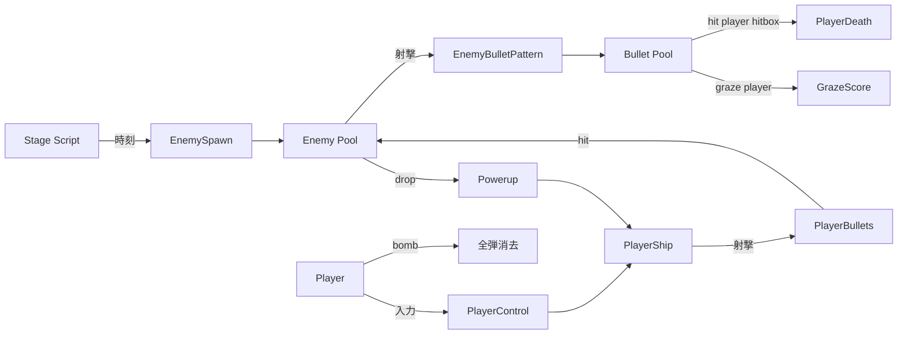

# シューティング (STG / SHMUP) テンプレート

## 概要

2D 縦 / 横スクロール固定弾幕シューター。 代表作は **Gradius**, **R-Type**, **Ikaruga**, **東方 Project**, **Cave (DoDonPachi 等)**, **斑鳩**。

コアループ:

> 自機が常に前進 → 敵 + 弾幕を撃破 / 回避 → アイテム取得 → 強化 → ボス → クリア / 死亡

特徴:

- **避ける** ことが楽しさの本体。 弾幕の **パターン設計** が中心
- 命中判定は **小さな自機 hitbox + 大きな見た目** が定石 (グレイズ判定)
- **パワーアップ** (オプション / レーザー / ホーミング / 子機) が個性
- **スコアアタック文化**: ノーミス / フルチェイン / 1cc クリア
- 1 ステージ 3-5 分 × 5-7 ステージ
- **STG 弾幕** はオブジェクト数が多い (数百-数千) ので SoA + プールが必須

## 必要不可欠な機能実装

- `[player-ship]` (新規) 自機制御 (固定速 + 入力で減速 / 集中モード)
- `[bullet-pattern]` 弾幕パターン (扇 / 円 / 螺旋 / ホーミング / 反射)
- `[bullet-pool]` (新規) 弾オブジェクトプール (数千)
- `[hitbox-system]` 自機の極小 hitbox (1-2px) + 弾の hitbox
- `[graze-system]` (新規) ニアミス判定 (スコア / ボム回復)
- `[enemy-pattern]` (新規) 敵の出現パターン (時刻 + 種別 + 経路)
- `[scrolling-stage]` (新規) ステージ強制スクロール + 背景多層
- `[powerup-system]` (新規) アイテムドロップ + 武器階位
- `[bomb-system]` (新規) 残機 / ボム消費の画面クリア
- `[score-system]` 撃破 + チェイン + グレイズ + アイテム取得
- `[life-extend]` (新規) スコアごとの残機追加
- `[boss-fight]` 多段フェーズ + 専用パターン
- `[continue-system]` (新規) クレジット制 (アーケード由来)
- `[seed-replay]` (新規) RNG 固定 → リプレイ可能

## コアドメイン設計



**境界づけられたコンテキスト**:

| Context | 主な型 |
|---------|--------|
| Stage | `StageScript`, `EnemyTimeline`, `BackgroundLayers` |
| Ship | `PlayerShip`, `WeaponLevel`, `OptionPattern`, `FocusMode` |
| Bullet | `BulletPool` (SoA), `BulletPattern`, `Emitter` |
| Enemy | `EnemyDef`, `EnemyInstance`, `MovementCurve` |
| Score | `Score`, `Chain`, `GrazeCount`, `Extend` |
| Boss | `Boss`, `Phase`, `Spell` (東方系) |
| Replay | `Seed`, `InputLog`, `Verifier` |

## 対応するコード設計

```rust
// crates/game-shmup/src/bullet.rs — SoA + プール
pub struct BulletPool {
    pub alive: Vec<bool>,      // 8000 個など
    pub pos:   Vec<Vec2>,
    pub vel:   Vec<Vec2>,
    pub kind:  Vec<BulletKind>,
    pub team:  Vec<Team>,      // Player / Enemy
}

impl BulletPool {
    pub fn tick(&mut self, dt: f32, world: &mut World) {
        for i in 0..self.alive.len() {
            if !self.alive[i] { continue; }
            self.pos[i] += self.vel[i] * dt;
            // 画面外で kill
            if !world.bounds.contains(self.pos[i]) {
                self.alive[i] = false;
                continue;
            }
        }
    }

    pub fn spawn(&mut self, pos: Vec2, vel: Vec2, kind: BulletKind, team: Team) -> Option<usize> {
        // 空きスロットを探して再利用 (free list 推奨)
        ...
    }
}

// crates/game-shmup/src/pattern.rs
//
// 弾幕パターンは「emitter」 を時間進行で動かす単純なステートマシン。
// (派手な東方系は Lua スクリプトで書くことが多い)
pub enum Emitter {
    Spread { center: Vec2, dir: f32, count: u32, spread_rad: f32, speed: f32, fired: bool },
    Ring   { center: Vec2, count: u32, speed: f32, fired: bool },
    Spiral { center: Vec2, base_angle: f32, step: f32, period: f32, until: f32, t: f32 },
    Homing { center: Vec2, target: Target, speed: f32, fired: bool },
}

impl Emitter {
    pub fn tick(&mut self, dt: f32, pool: &mut BulletPool, team: Team) {
        match self {
            Emitter::Spread { center, dir, count, spread_rad, speed, fired } => {
                if *fired { return; }
                let half = *spread_rad * 0.5;
                let step = if *count > 1 { *spread_rad / (*count - 1) as f32 } else { 0.0 };
                for i in 0..*count {
                    let theta = *dir - half + step * i as f32;
                    pool.spawn(*center, Vec2::from_angle(theta) * *speed, BulletKind::Round, team);
                }
                *fired = true;
            }
            Emitter::Spiral { center, base_angle, step, period, until, t } => {
                *t += dt;
                if *t > *until { return; }
                if *t > *period {
                    *t -= *period;
                    *base_angle += *step;
                    pool.spawn(*center, Vec2::from_angle(*base_angle) * 80.0, BulletKind::Round, team);
                }
            }
            ...
        }
    }
}

// crates/game-shmup/src/hit.rs
//
// 自機 hitbox は 1-2px 想定 (グレイズは別)。
pub fn check_player_hit(player: &PlayerShip, bullets: &BulletPool) -> Option<usize> {
    for i in 0..bullets.alive.len() {
        if !bullets.alive[i] || bullets.team[i] != Team::Enemy { continue; }
        let d = (bullets.pos[i] - player.pos).length();
        if d < player.hitbox_r + bullet_radius(bullets.kind[i]) {
            return Some(i);
        }
        if d < player.graze_r {
            // グレイズスコア + ボム回復
        }
    }
    None
}
```

```text
src/
  ship/          PlayerShip + WeaponLevel + Option
  bullet/        BulletPool + Emitter (Pattern DSL)
  enemy/         EnemyPool + Movement curve + Drop
  stage/         StageScript + Background layers + Spawn timeline
  boss/          Boss + Phase + Spell
  score/         Score + Chain + Graze + Extend
  bomb/          Bomb + ScreenClear + Invuln
  replay/        InputLog + ReplayPlayer
  ui/            HUD + Continue + ResultScreen
```

依存:
- `ergo_score`
- `ergo_input` (固定 60 fps + リプレイ前提なので入力サンプリングは決定論)
- 描画は GPU instancing (Pictor)
