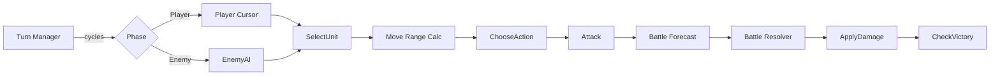

# グリッド SLG テンプレート

## 概要

ターン制 + ヘックス / 四角グリッドのストラテジー RPG。 代表作は **Fire Emblem**, **Final Fantasy Tactics**, **Tactics Ogre**, **Triangle Strategy**, **Advance Wars**。

コアループ:

> 自軍ターン (各ユニット 1 行動) → 敵ターン (AI 行動) → 戦闘発生 → ステータス更新 → 全滅 / 勝利条件チェック → 次ターン

特徴:

- **盤面 (グリッド)** が中心。 距離 / 高低差 / 地形効果 / 移動コストがすべてセル単位
- 1 戦闘 = 1 ステージ、 ステージ間に**会話シーン** + **拠点メニュー** (FE) または **隊列メニュー** (FFT) を挟む
- ユニットの **クラス + 装備 + スキル** が組合せの肝
- 戦闘予測 (ダメージ % / 命中 % / クリ %) を「攻撃前にプレイヤーに見せる」 のがジャンル定石

## 必要不可欠な機能実装

- `[hex-grid]` 盤面 (hex / square 切替可)
- `[unit-action]` ユニットの 1 ターン行動 (移動 + 攻撃 / スキル / 待機)
- `[movement-range]` (新規) 移動可能セル計算 (ダイクストラ + 地形コスト)
- `[attack-range]` (新規) 攻撃 / スキルの射程セル計算
- `[battle-forecast]` (新規) 戦闘前のダメージ / 命中 / クリ予測表示
- `[stat-system]` HP / 攻 / 防 / 速 / 技 / 運 / 移動力
- `[class-system]` (新規) クラス → ステータス成長補正 + スキル
- `[turn-manager]` (新規) Player/Enemy/Allied/Other フェーズ管理
- `[unit-ai]` (新規) 敵ターンの行動選択 (移動先 + ターゲット選び)
- `[victory-defeat]` (新規) ステージ勝利 / 敗北条件 (全滅 / リーダー撃破 / N ターン以内 / 占領)
- `[map-loader]` (新規) ステージマップ + ユニット配置 + 勝敗条件のロード
- `[dialogue-system]` ステージ前後のイベント会話
- `[save-load]` 章ごと / ターンごとの中断セーブ
- `[level-up-screen]` (新規) ランダム成長率での Lv up 表示

## コアドメイン設計



**境界づけられたコンテキスト**:

| Context | 主な型 |
|---------|--------|
| Map | `Grid`, `Cell (terrain, height, occupant)`, `Path`, `MapDef` |
| Unit | `Unit`, `Class`, `Stats`, `Skill`, `Equipment`, `Inventory` |
| Turn | `TurnManager`, `Phase`, `ActionUsed[]` |
| Battle | `BattleEvent`, `Forecast`, `DamageResolver`, `HitRng` |
| Campaign | `Chapter`, `MapLoader`, `EventScript`, `SaveSlot` |

## 対応するコード設計

```rust
// crates/game-slg/src/grid.rs
pub struct Grid {
    pub w: u16,
    pub h: u16,
    pub kind: GridKind,         // Hex | Square
    pub cells: Vec<Cell>,       // length = w*h
}

#[derive(Clone)]
pub struct Cell {
    pub terrain: TerrainId,
    pub height: i16,
    pub occupant: Option<UnitId>,
}

impl Grid {
    pub fn move_range(&self, from: Coord, mp: u16, unit: &Unit, ctx: &TerrainTable) -> Vec<(Coord, u16)> {
        // ダイクストラ。 cost = ctx.cost(terrain, unit.class)
        // 戻り値: 到達可能セル + 残 MP
        ...
    }
    pub fn attack_range(&self, from: Coord, weapon: &Weapon) -> Vec<Coord> { ... }
}

// crates/game-slg/src/turn.rs
pub struct TurnManager {
    pub turn:  u32,
    pub phase: Phase,
    pub used:  HashSet<UnitId>,
}

impl TurnManager {
    pub fn end_action(&mut self, u: UnitId) {
        self.used.insert(u);
        if self.all_used_for_phase() { self.advance_phase(); }
    }
}

// crates/game-slg/src/battle.rs
pub fn forecast(att: &Unit, def: &Unit, terrain: TerrainEffect) -> Forecast {
    let dmg = (att.stats.atk - def.stats.def + att.equip.might).max(0);
    let hit = (att.stats.skl * 2 + att.equip.hit) - def.stats.spd - terrain.evasion;
    let crit = att.stats.skl / 2 + att.equip.crit;
    Forecast { dmg, hit: hit.clamp(0, 100), crit: crit.clamp(0, 100) }
}
```

```text
src/
  grid/          Grid + Cell + Pathfinding (Dijkstra)
  unit/          Unit + Class + Stats + Skill
  turn/          TurnManager + Phase
  battle/        Forecast + Resolver + RNG
  ai/            EnemyAI (heuristic / utility)
  campaign/      Chapter + Map loader + Events
  ui/            Cursor + RangeOverlay + ForecastUI + UnitInfo
```

依存:
- `ergo_health` `ergo_input` `ergo_frame`
- 戦闘 RNG は seed 固定可能にする (ロード後の再現性)
