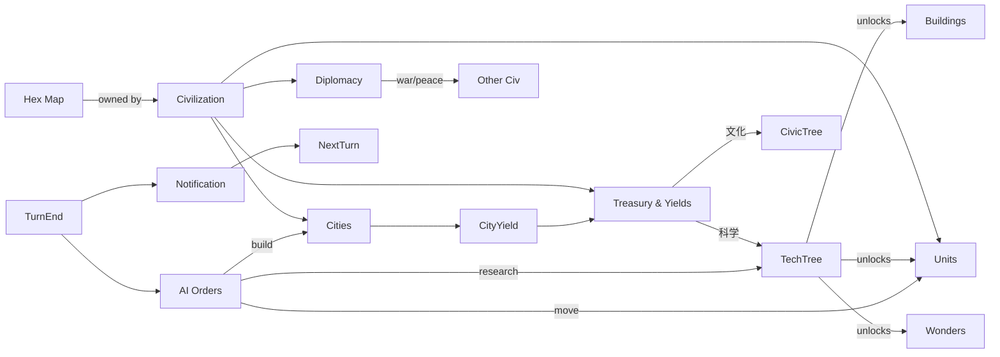

# 4X / グランドストラテジー テンプレート

## 概要

eXplore / eXpand / eXploit / eXterminate の **4X** ストラテジー。 代表作は **Sid Meier's Civilization**, **Endless Legend**, **Stellaris**, **Crusader Kings**。

コアループ:

> ターン (年) 進行 → 都市 / ユニット 1 つずつ操作 → 研究進行 → 外交イベント → AI ターン → 勝利条件チェック → 翌ターン

特徴:

- **長尺セッション** (1 試合 6-20 時間)。 セーブ・ロード品質が UX を決める
- **マルチテック軸** (科学・文化・宗教・経済・軍事) が独立に進む
- **AI が同等のルールで動く** ことが大事 (チートで強くしすぎない)
- 「**前のターンに何が起きたか**」 をプレイヤーに通知する **アラートキュー** が必須

## 必要不可欠な機能実装

- `[hex-grid]` 大規模六角マップ (1000+ タイル)
- `[fog-of-war]` (新規) 自勢力 / 同盟ごとの可視範囲管理
- `[city]` (新規) 都市オブジェクト (人口 / 食料 / 生産 / 文化 / 信仰 / 区画)
- `[unit-types]` (新規) ユニット系統 (戦士 / 弓 / 騎兵 / ...) + Tier
- `[resource-economy]` 資源 (食料 / 生産 / 金 / 科学 / 文化 / 信仰)
- `[tech-tree]` 科学ツリー (前提付きノード DAG)
- `[civic-tree]` (新規) 文化ツリー (科学とは別軸)
- `[diplomacy]` (新規) 国家関係 (同盟 / 戦争 / 通商 / 抗議)
- `[trade-route]` (新規) 都市間 / 国家間の貿易路
- `[turn-manager]` 年次ターン + AI 同時行動 (orders queue)
- `[event-system]` (新規) ランダム + 連鎖イベント (CK 系)
- `[victory-condition]` (新規) 科学 / 文化 / 制覇 / 外交 / 信仰 ...
- `[save-load]` 巨大 state を圧縮シリアライズ (zstd など)
- `[notification-queue]` (新規) ターン頭にプレイヤー通知一覧

## コアドメイン設計



**境界づけられたコンテキスト**:

| Context | 主な型 |
|---------|--------|
| Map | `Grid`, `Tile (terrain, feature, resource, owner)`, `FogOfWar` |
| Civ | `Civilization`, `Treasury`, `Government`, `Religion`, `Researcher` |
| City | `City`, `Population`, `District`, `Building`, `BuildQueue` |
| Unit | `UnitType`, `UnitInstance`, `MovementOrder`, `Promotion` |
| Tech | `TechNode`, `CivicNode`, `Prerequisites`, `Unlocks` |
| Diplomacy | `Relation`, `Treaty`, `War`, `Trade` |
| World | `TurnManager`, `EventDeck`, `NotificationQueue`, `VictoryCheck` |

## 対応するコード設計

巨大 state なので **イミュータブル更新** + **オーダーキュー** が安定する:

```rust
// crates/game-strat4x/src/state.rs
pub struct WorldState {
    pub turn: u32,
    pub map:  Grid,
    pub civs: Vec<Civilization>,        // インデックス安定 (削除しない)
    pub fog:  HashMap<CivId, FogOfWar>,
    pub events: EventDeck,
    pub notifs: HashMap<CivId, Vec<Notification>>,
}

// crates/game-strat4x/src/orders.rs
pub enum Order {
    MoveUnit  { civ: CivId, unit: UnitId, path: Vec<Coord> },
    BuildItem { civ: CivId, city: CityId, item: BuildItem },
    SetResearch { civ: CivId, tech: TechId },
    Diplomacy { from: CivId, to: CivId, action: DiploAction },
    EndTurn   { civ: CivId },
}

// crates/game-strat4x/src/turn.rs
pub fn advance_turn(world: &mut WorldState, orders: Vec<Order>) -> Vec<Notification> {
    // 1. プレイヤーの orders を適用
    for o in orders { apply_order(world, o); }
    // 2. AI 各勢力の orders を生成 + 適用
    let ai_orders = world.civs.iter()
        .filter(|c| c.is_ai)
        .flat_map(|c| ai::propose(world, c.id))
        .collect::<Vec<_>>();
    for o in ai_orders { apply_order(world, o); }
    // 3. 都市生産・科学進行・税収
    economy::tick(world);
    // 4. ランダムイベント
    let events = world.events.draw(world.turn);
    for ev in events { event::apply(world, ev); }
    // 5. 勝利条件チェック
    if let Some(v) = victory::check(world) {
        return vec![Notification::Victory(v)];
    }
    world.turn += 1;
    // 6. notifications を返す
    drain_notifs(world)
}
```

```text
src/
  state.rs       WorldState aggregate
  map/           Grid + Tile + FogOfWar
  civ/           Civilization + Treasury + Government
  city/          City + Population + Buildings
  unit/          UnitType + UnitInstance + Promotion
  tech/          TechTree + CivicTree
  diplomacy/     Relations + Treaties
  orders/        Order + applier
  turn/          TurnManager + advance_turn
  ai/            Strategic + Operational + Tactical layers
  event/         EventDeck + chains
  victory/       VictoryCondition checks
  save/          serde + zstd
  ui/            CityScreen, TechTreeUI, DiploScreen, Minimap
```

依存:
- 純粋ロジックが大半なので **ユニットテストでターン進行を検証** できる作り
- 描画は別 crate (大きすぎるため `game-strat4x-render` に分離推奨)
