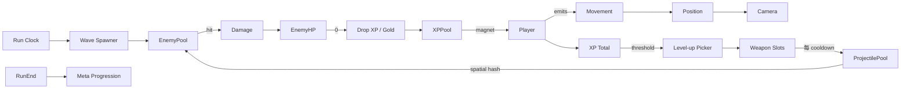

# バンサバライク テンプレート

## 概要

**Vampire Survivors** が確立した「自動攻撃 + 大量湧き敵 + 短時間ラン + ロード」 ゲームジャンル。
代表作は **Vampire Survivors**, **Brotato**, **Halls of Torment**, **Soulstone Survivors**。

コアループ:

> 移動だけ手動 → 武器が自動発射 → 大量敵を倒す → 経験値 → レベルアップで武器/パッシブ追加 → 数百体規模の同時画面 → 30 分耐久 / 死亡

設計上の特徴:

- **大量エンティティ** (敵 1000+ / 弾 数百) を 60 fps で動かすため、 描画 + sim とも data-oriented (SoA) が事実上必須
- **武器の組合せシナジー** がリプレイ性を担う
- 移動以外プレイヤー操作なし → AI と弾道は完全に自走
- セッションは 20-30 分の使い切り、 メタ進行 (お金 / 永久パッシブ) で長期動機

## 必要不可欠な機能実装

- `[entity-pool]` (新規) 敵 / 弾 / pickup の事前確保プール (毎フレーム alloc 回避)
- `[spatial-hash]` (新規) 大量エンティティの近傍検索 (固定セル化)
- `[health-system]` プレイヤー HP + 敵 HP (大量同時)
- `[xp-pickup]` (新規) 撃破 → 経験値ジェム → 自動吸引 (磁石半径)
- `[leveling]` レベルアップ → 武器 / パッシブ選択画面
- `[weapon-auto-fire]` (新規) クールダウン駆動の自動武器
- `[weapon-evolution]` (新規) 武器 + 必須パッシブ → 進化武器
- `[wave-spawner]` (新規) 時間軸スクリプトに沿った敵スポーン (経過分単位)
- `[damage-numbers]` (新規 / 任意) ダメージポップアップ
- `[meta-progression]` (新規) ラン横断のお金 / 永久強化 / アンロック
- `[score-system]` 撃破数 / 残り時間 / コイン

## コアドメイン設計



**境界づけられたコンテキスト**:

| Context | 主な型 |
|---------|--------|
| Run | `RunClock`, `Score`, `Difficulty`, `WaveSpawner` |
| Player | `PlayerActor`, `XPPool`, `WeaponSlots`, `PassiveSlots` |
| Entity | `EnemyPool`, `ProjectilePool`, `XpGemPool`, `PickupPool` |
| Spatial | `SpatialHash` (cell size 64-128 units) |
| Meta | `Currency`, `Unlock`, `MetaUpgrade` |

## 対応するコード設計

データ指向で書く (Vec ベースの SoA):

```rust
// crates/game-vampsurv/src/enemies.rs — SoA pool
pub struct EnemyPool {
    pub alive:  Vec<bool>,        // 1000+
    pub pos:    Vec<Vec2>,
    pub vel:    Vec<Vec2>,
    pub hp:     Vec<i32>,
    pub kind:   Vec<EnemyKind>,
}

impl EnemyPool {
    pub fn tick(&mut self, dt: f32, player: Vec2) {
        for i in 0..self.alive.len() {
            if !self.alive[i] { continue; }
            let dir = (player - self.pos[i]).normalize_or_zero();
            self.vel[i] = dir * speed_for(self.kind[i]);
            self.pos[i] += self.vel[i] * dt;
        }
    }

    pub fn kill(&mut self, i: usize) {
        self.alive[i] = false;
        // free index goes back into the pool's free-list
    }
}

// crates/game-vampsurv/src/spatial_hash.rs
pub struct SpatialHash {
    cell: f32,
    map: HashMap<(i32, i32), Vec<u32>>, // cell -> indices
}

impl SpatialHash {
    pub fn rebuild(&mut self, pos: &[Vec2], alive: &[bool]) {
        self.map.clear();
        for (i, &p) in pos.iter().enumerate() {
            if !alive[i] { continue; }
            let key = (
                (p.x / self.cell) as i32,
                (p.y / self.cell) as i32,
            );
            self.map.entry(key).or_default().push(i as u32);
        }
    }
    pub fn query(&self, c: Vec2, r: f32, mut visit: impl FnMut(u32)) {
        let cmin = ((c.x - r) / self.cell) as i32;
        let cmax = ((c.x + r) / self.cell) as i32;
        let rmin = ((c.y - r) / self.cell) as i32;
        let rmax = ((c.y + r) / self.cell) as i32;
        for x in cmin..=cmax {
            for y in rmin..=rmax {
                if let Some(v) = self.map.get(&(x, y)) {
                    for &i in v { visit(i); }
                }
            }
        }
    }
}
```

```text
src/
  run/           RunClock + WaveSpawner + Difficulty
  player/        Controller + XP + Slots
  enemy/         EnemyPool (SoA)
  projectile/    ProjectilePool (SoA)
  pickup/        XpGem / Coin / Magnet
  weapon/        Definitions + Cooldown + Evolution rules
  spatial/       SpatialHash
  meta/          Currency + Unlock + MetaUpgrade
  ui/            LevelUpPicker + RunHUD + DamageText
```

依存:
- `ergo_health` (プレイヤー HP は ergo、 敵は SoA で自前)
- `ergo_score`
- `ergo_input` (移動のみ)
- 描画は GPU instancing (Pictor 側) が望ましい
